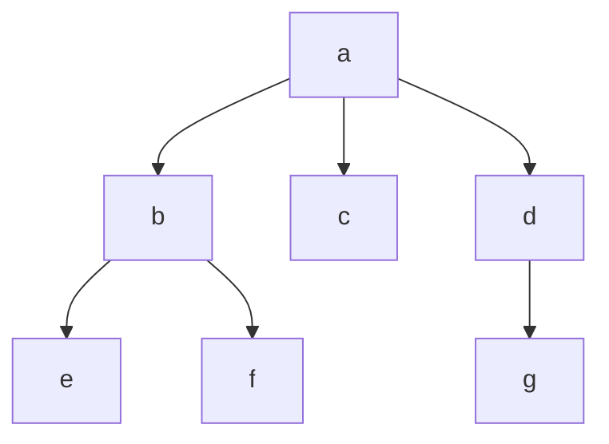

**Intent, stated precisely:** you want two distinct mathematical objects extracted from `Forker`, not two views of the same one:

1. A **poset** on the set of process names, induced by the ancestor relation the tree encodes — equivalently, the **thin category** freely generated by the `do_fork` edges under transitive/reflexive closure.
2. A **state machine** — formally a **labelled transition system (LTS)**, or a **Mealy-machine coalgebra** if you also want the printed output tracked — over the mutable triple $(process\_list, children, parents)$, with `fork`/`exit` as the alphabet.

These are genuinely different structures: the poset is *static*, derived from one fixed run's parent function; the LTS is *dynamic*, ranging over all possible sequences of actions the loop in `run()` can execute.

---

### 1. The poset

Set-theoretically: let $P$ be the set of process names ever allocated (`self.process_list` plus exited names). Define the parent function
$$\pi : P \setminus \{a\} \rightharpoonup P$$
(partial, since exited/orphaned nodes get reassigned — this is exactly what `do_fork`/`do_exit` mutate). Take $\preceq$ to be the reflexive–transitive closure of $\pi$:
$$p \preceq q \iff p = q \ \text{or}\ \exists n\ge 1,\ \pi^{(n)}(q) = p.$$

This is a genuine partial order (reflexive, antisymmetric, transitive) precisely because $\pi$ is acyclic and single-valued — a fork can never make two parents point to the same child. Root $a$ is the **bottom element**: $\forall p,\ a \preceq p$.

Category-theoretically, $(P,\preceq)$ **is** a thin category $\mathcal C$: objects are process names, and there is a unique morphism $p \to q$ iff $p \preceq q$; composition is transitivity, identities are reflexivity. `do_fork(p, c)` is literally the act of adding a generating morphism $p \to c$; the poset is the **preorder reflection** of that generator graph.

Note it's only a **meet-semilattice**, not a lattice: any two nodes have a greatest lower bound (their nearest common ancestor always exists, since the tree is connected with a bottom), but a least upper bound only exists when one node already lies below the other.

Using the tree from your header comment ($a$ forks $b,c,d$; $b$ forks $e,f$; $d$ forks $g$), the Hasse diagram (covering relations = the actual `do_fork` calls) is:

---

### 2. The state machine

This is an LTS $(Q, \Sigma, \delta)$:

$$Q = \{(A,\pi) \mid A \subseteq \text{Names},\ \pi : A\setminus\{a\} \to A\}$$

— a state is exactly the pair `(process_list, parents)` (`children` is redundant, it's the fiber $\pi^{-1}$).

$$\Sigma = \{\,\mathrm{fork}(p,c) \mid p \in \text{Names},\, c\ \text{fresh}\,\} \;\cup\; \{\,\mathrm{exit}(p)\mid p \in \text{Names}\,\}$$

$\delta : Q \times \Sigma \rightharpoonup Q$ is **partial**, not total — the guards in `check_legal`/`do_exit` (root can't exit, `leaf_only` blocking exit of a node with children, membership in `process_list`) are exactly the domain restriction of $\delta$. So this is an LTS with **guarded transitions**, not a plain automaton.

There's a genuine fork in the definition of $\delta$ on `exit`: `local_reparent` selects between two different morphisms with the same type signature $Q \to Q$ —
$$\delta_{\text{local}}(\cdot,\mathrm{exit}(p)) : \text{orphans} \mapsto \text{parent}(p)$$
$$\delta_{\text{global}}(\cdot,\mathrm{exit}(p)) : \text{orphans} \mapsto a$$
— a boolean-indexed choice of transition function, i.e. $\delta$ is really $\delta_b$ for $b \in \{0,1\}$, a family classified by a map into $\mathbf 2$.

If you also want the printed tree tracked (what `-t`/`-F` actually display), that's the output component of a **Mealy coalgebra** for the functor $F(X) = O \times X^{\Sigma}$, where $O$ = rendered tree strings — `walk`/`print_tree` is the observation map $Q \to O$.

Concretely running the example action list `a+b, a+c, a+d, b+e, b+f, d+g` traces one path through this LTS:

Each $S_i \in Q$ is the accumulated $(A,\pi)$ pair after $i$ actions; the poset from Part 1 is exactly the terminal state $S_6$'s $\pi$-closure, i.e. **the poset is $\preceq$-closure of one fixed reachable state of the LTS**, not the LTS itself. That's the precise relationship between your two requested objects.