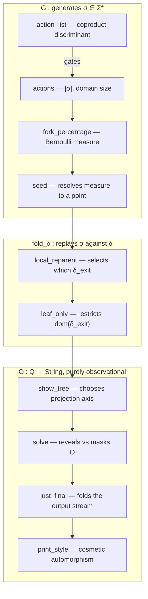

**Intent, named precisely:** you're asking for a **causal factorization of the parameter space** — i.e., decompose `Args = {seed, fork_percentage, action_list, actions, show_tree, print_style, just_final, leaf_only, local_reparent, solve}` into a composite of maps, then rank each coordinate by how much of `run()`'s downstream behavior it *determines* (its position in a **dependency poset**, ordered by "how much factors through me").

### The factorization

`run()` is a composite of three maps, and this composite *is* the funnel — everything below follows from where a parameter sits in it:

$$\text{run} \;=\; O \;\circ\; \mathrm{fold}_\delta \;\circ\; G$$

- $G : \text{Params}_{\text{gen}} \to \Sigma^{*}$ — generates the action trace (a word in the LTS alphabet from the previous answer)
- $\mathrm{fold}_\delta : \Sigma^{*} \times Q_0 \to Q$ — the unique extension of $\delta$ over the free monoid $\Sigma^{*}$ (this *is* what "replaying the trace" means, formally: the universal property of $\Sigma^*$ as free monoid on $\Sigma$)
- $O : Q \to \text{String}$ — the Mealy output/observation map

A parameter's importance = **how far upstream it sits in this composite**, since upstream changes propagate through everything after them, while downstream (i.e. $O$-only) changes are informationally inert on $Q$.

### Ranked, with the algebraic reason for each rank

1. **`action_list`** — the **coproduct discriminant**. `Params_gen ≅ ActionList ⊕ (Seed × ForkPct × Actions)`, and this argument literally *chooses the summand*. Nothing has more leverage than picking which algebra the rest of the parameters even live in.
2. **`actions`** *(live only in the right summand)* — fixes $|\sigma|$, the cardinality of $\Sigma^*$'s domain being sampled. Determines the **shape** (length) of everything downstream before any content exists.
3. **`fork_percentage`** — defines the Bernoulli($p$) product measure over $\{\text{fork},\text{exit}\}$ at each step. Determines the **distribution** over possible $\sigma$, i.e. shapes the whole space of reachable trees.
4. **`seed`** — the map $\Omega \to \Sigma^*$ that collapses that distribution to one concrete realization. Determines a **point**, not a shape — one level less powerful than #3, since two different seeds under the same $p$ still live in the same space of possible outcomes.
5. **`local_reparent`** — this is not part of $G$ at all; it mutates $\delta$ **itself**, selecting between two distinct exit-morphisms $\delta_{\text{local}}$ vs $\delta_{\text{global}}$. Since it changes the transition function, it acts on *every* subsequent state regardless of which $\sigma$ was fed in.
6. **`leaf_only`** — also mutates $\delta$, but only by **restricting its domain** (a guard, not a rewrite) — narrower effect than #5, since it can only ever suppress transitions, never redirect them.
7. **`show_tree`** — the first $O$-only parameter, but it's a **branch inside $O$**: it picks which of the two dual observation axes (mask the tree, show actions / vs. mask actions, show tree) is even active.
8. **`solve`** — nested inside #7's branch: a further boolean gate on whether that chosen axis is revealed or hidden.
9. **`just_final`** — folds the sequence of intermediate observations $(O_0,\dots,O_n)$ down to just $O_n$. Changes *how much* of $O$'s output you see, not its content.
10. **`print_style`** — a pure bijective relabeling of glyphs used to render $O$'s output. Zero information-theoretic effect on $Q$ or on the content of $O$; it's an automorphism of the character alphabet only.