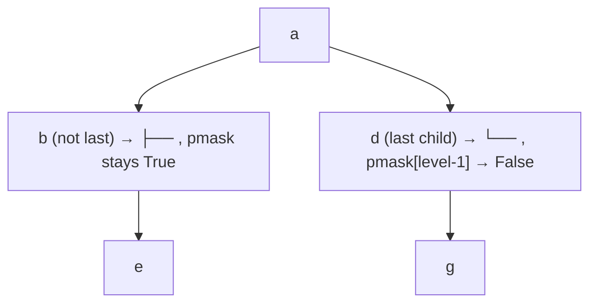

**Intent:** you're debugging the `basic` branch of `walk`, specifically (a) confirming `p` ≡ the current node being visited, and (b) misreading the recursion because a `print` line got dropped when you copied it — plus asking what `pmask`/`is_last` encode.

### 1. Yes — `p` is `curr_proc`

`walk(p, level, pmask, is_last)` visits node `p` on each call. `self.root_name` is the first `p`; every recursive call passes a **child** of the current `p` as the next call's `p`. So across the whole recursion, `p` ranges over every element of $P$ exactly once — `walk` is a **depth-first traversal function** $P \to \mathbf 1$ (as established last message), and `p` is literally the traversal's current position.

### 2. The bug in your transcription

Your snippet is missing a line. The real `basic` branch is:

```python
elif self.print_style == 'basic':
    for i in range(level):
        print('   ', end='')
    print('%2s' % p)                       # <-- this line prints the node itself
    for child in self.children[p]:
        self.walk(child, level + 1, {}, False)
    return
```

Two corrections to your reading:
- It doesn't print an empty string — `print('%2s' % p)` prints **the node's name**, right after the indentation spaces. Drop that line (as your version did) and yes, you'd get blank lines with no node name, which is what confused you.
- The `return` is **outside** the `for child in ...` loop (same indentation as the `for`, one level less than the loop body), not inside it. So it doesn't "return immediately" after the first child — it recurses into **every** child, then returns once, after all of them are done. If `return` were inside the loop, you'd only ever render the leftmost subtree and silently discard every sibling — that would be a genuine bug, but it isn't present in the source.

### 3. What `pmask` and `is_last` encode

These two only matter in the connector-drawing styles (`line1`, `line2`, `fancy`) — `basic` ignores them entirely, which is exactly why `basic` passes `{}` and `False` and never looks at them again.

Set-theoretically: `pmask : \{0,\dots,\text{level}-1\} \to \mathbf{Bool}$ is a **partial function recording, for each ancestor depth, whether that ancestor still has undrawn siblings below it**. Formally, at the moment node $p$ (at depth $d$) is drawn, for every ancestor $a_i$ at depth $i < d$:
$$\texttt{pmask}[i] = \text{True} \iff a_i \text{ is not the last child of its own parent}$$

That boolean controls whether the vertical continuation bar `│` is drawn in column $i$ or left blank — because if $a_i$ *was* the last child, there's nothing left below it in that column, so the bar should stop.

`is_last : \mathbf{Bool}$ is the local, one-node version of the same fact — is *this* node the last element in its parent's children-list (`self.children[parent][-1]`)? It governs which of two glyphs caps the current row: `├──` (there are more siblings after this one) vs `└──` (this is the final child, close the branch).

The recursive update is where the poset structure actually shows up:
```python
if is_last:
    pmask[level-1] = False   # this ancestor's column stops needing a bar
pmask[level] = True          # this node, being visited, defaults to "has more to draw"
```
So `pmask` is exactly a running record of **which ancestors on the current root-to-p path are the rightmost child at their depth** — it's the same ancestor chain that defines $p \preceq q$ in the poset from earlier, just annotated with a boolean per level so the renderer knows where to keep drawing lines.

Visually, contrast a middle child vs. a last child at the same level:



Everything under `d`'s column then omits the `│` prefix, because `pmask` at that depth was flipped to `False` the moment `d` (being last) was drawn.