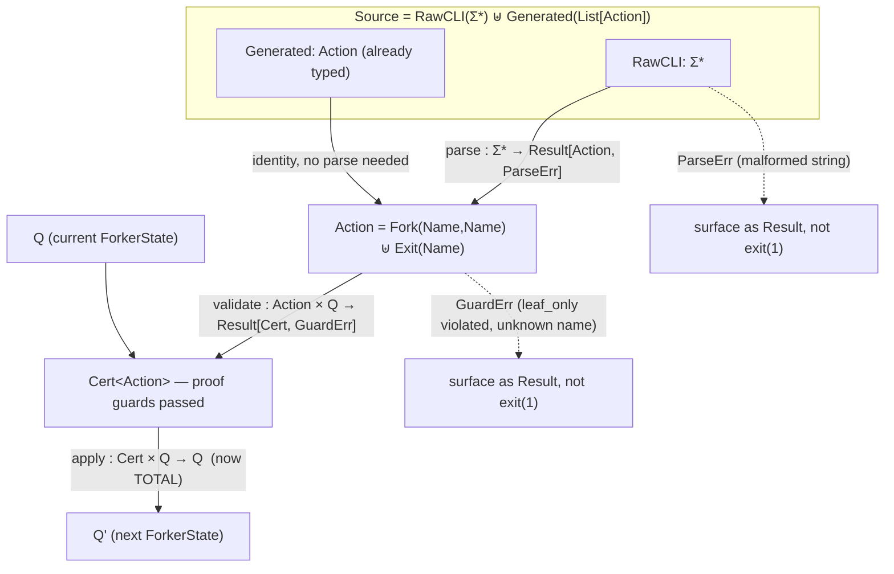

**Intent, named precisely:** four distinct findings — (1) a **type/name collision** between two different values sharing the identifier `action_list`, (2) an **abstract data type mismatch**: the frontier needs an operation set that neither `List` nor `HashMap` alone provides, (3) a **needless round-trip through the free monoid** $\Sigma^*$ when the generator already knows the typed answer, (4) confirmation that `just_final` is a **policy on the output functor $O$**, not on $\delta$. Then the full $\delta$-factorization per Parse-Don't-Validate / capability discipline.

---

### 1. The `action_list` collision

`ForkerConfig.action_list : str` (raw, possibly-empty CLI flag) and the local `action_list : List[str]` inside `run()` are **different types occupying the same name across a stage boundary** — one is a point in $\Sigma^*_{\text{raw}}$ (comma-joined), the other a point in $\text{List}[\Sigma^*]$ (already split). Rename the config field to `action_list_arg` or `raw_action_list`; keep `action_list` for the parsed list. This isn't cosmetic — it's exactly the kind of ambiguity that makes it easy to accidentally pass the wrong stage's value into the next function.

### 2. Frontier topology

`fork_candidate_frontier` needs exactly two operations: **uniform random sample**, and **remove-by-value**. That's the actual algebraic signature required — check it against each candidate structure:

| structure | uniform sample | remove(x) |
|---|---|---|
| `List` (current) | $O(1)$ via random index | $O(n)$ — `.remove` linear-scans |
| `HashMap`/`HashSet` | **no $O(1)$ random-index op** — no ordinal structure to sample by index at all | $O(1)$ |
| indexed set (`Vec` + swap-remove, or `indexmap::IndexSet` in Rust) | $O(1)$ | $O(1)$ amortized |

So a `HashMap` is the *wrong* direction — you'd lose random-sampling entirely, not gain anything, since a hash map has no notion of "the $k$-th element." The right structure is an **indexable set**: a `Vec<Name>` plus a companion `HashMap<Name, usize>` for O(1) position lookup, so `remove(x)` becomes swap-with-last-then-pop instead of a linear scan. This is precisely `indexmap::IndexSet` in Rust — it's the canonical answer to "I need a set with $O(1)$ uniform sampling and $O(1)$ removal," which is a strictly more specific ADT than either `List` or `HashMap` alone expresses.

### 3. The generate-then-reparse round-trip

Currently $G$ (the generator) **already knows** the typed `Fork(parent,child)` / `Exit(name)` value it's producing — then immediately serializes it to a string (`'%s+%s' % (...)`) purely so that `action_step` can parse that same string straight back into the value it started as. Formally:

$$G_{\text{typed}} \xrightarrow{\;\text{serialize}\;} \Sigma^* \xrightarrow{\;\text{parse}\;} G_{\text{typed}}$$

— composing serialize-then-parse should be (and mathematically *is*, when both are correct inverses) the identity, so this leg of the pipeline does real work for zero informational gain, and is a place a typo or format drift could silently break round-tripping.

The fix: `Action` should be a proper sum type from the start, and there should be **two disjoint entry points into the fold**, not one:

$$\text{Source} \;=\; \underbrace{\text{RawCLI}(\Sigma^*)}_{\text{-A flag: needs Tier-1 parse}} \;\uplus\; \underbrace{\text{Generated}(\text{List}[\text{Action}])}_{\text{already typed, skip parse}}$$

`new_action_list` should return `List[Action]` directly (never touching strings at all), and only the CLI-supplied branch goes through `handle_check_legal`. The serialized string form should exist **only** as something you print for the human-readable action log — not as the internal transport format between $G$ and $\delta$.

### 4. `just_final` — confirmed as an $O$-policy

Yes: it doesn't change $\delta$ or $Q$ at all — it only decides whether $O$ is applied after *every* fold step or only once, at the end. Formally, without it $O$ is applied to the whole trajectory $\langle Q_0, Q_1, \dots, Q_n\rangle$; with it, $O$ is applied only to $Q_n$. It's a **fold-vs-scan choice on the observation side**:
$$\text{just\_final} = \text{False} \Rightarrow O \circ \text{scan}(\delta) \qquad \text{just\_final} = \text{True} \Rightarrow O \circ \text{fold}(\delta)$$
(`scan` returns every intermediate state, `fold` collapses to the last) — same distinction as Haskell's `scanl` vs `foldl`.

---

### 5. Factorizing `action_step`, Parse-Don't-Validate / capability style

The sel4/Lampson-style discipline is: **once something has been checked, its type should prove it was checked** — you never re-inspect a raw value's validity twice, because the *type itself* is the certificate (a capability). Jane Street's "parse, don't validate" is the same idea from the functional side: don't return a bool and re-branch on it downstream; return a **refined type** that only exists once validation succeeded, so illegal states become unrepresentable past that point.

Applied here, $\delta$ decomposes into three strictly separated stages, each a **total function into a `Result`/`Either`**, never a partial function that calls `exit(1)`:

$$\underbrace{\text{parse}}_{\Sigma^* \to \text{Result}[\text{Action}, \text{ParseErr}]} \;\to\; \underbrace{\text{validate}}_{\text{Action} \times Q \to \text{Result}[\text{Cert}, \text{GuardErr}]} \;\to\; \underbrace{\text{apply}}_{\text{Cert} \times Q \to Q}$$

- **`parse`** — pure syntax check, no access to `ForkerState` at all (as flagged before, this separation was already right). Returns `Result<Action, ParseErr>`, never exits the process.
- **`validate`** — checks the *semantic* guards against the current state: does `fork_choice`/`exit_choice` exist in `process_list`? does `leaf_only` forbid this exit? This is exactly the domain-restriction of $\delta$ from the LTS. Crucially, its output isn't a bool — it's a **new type**, `ValidatedAction` (or `Cert<Action>`), a certificate that carries the *proof* the checks passed, constructed only inside `validate`'s success branch. Nothing outside `validate` can construct a `Cert` except by passing through it — that's the capability discipline: possession of the value **is** the proof.
- **`apply`** — takes a `Cert<Action>` and is now **total** — no more error branches are possible here, because `Cert`'s existence already rules them out. This is the payoff of the discipline: `apply`'s type signature alone tells you it can't fail, so you never need runtime re-checks or a stray "this shouldn't happen" branch deep inside the state-mutation logic.

The partition to hold onto: **`Action` is a coproduct over syntax; `Cert<Action>` is a refinement over semantics** — two independent axes, and the current code conflates them by letting `handle_bad_action`'s `exit(1)` do double duty as both a parse-failure handler and (implicitly) a validation-failure handler. Splitting them means `action_step` itself becomes almost trivial — just the three-arrow composite above — and every actual decision (what counts as legal syntax, what counts as a legal guard) lives in exactly one place, checkable in isolation.