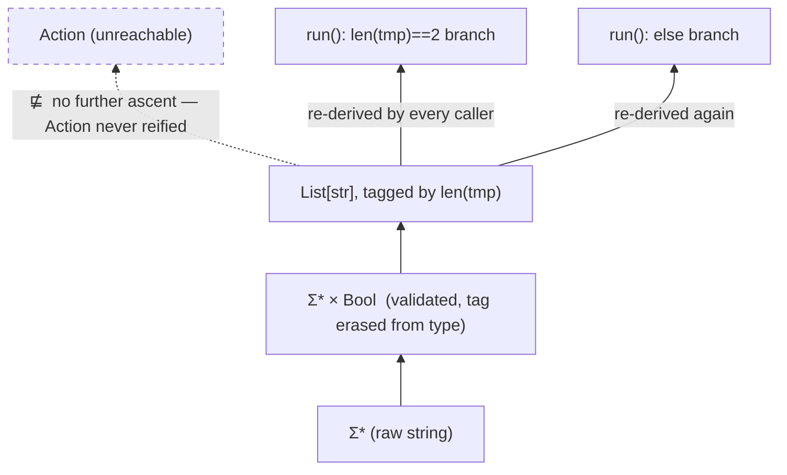
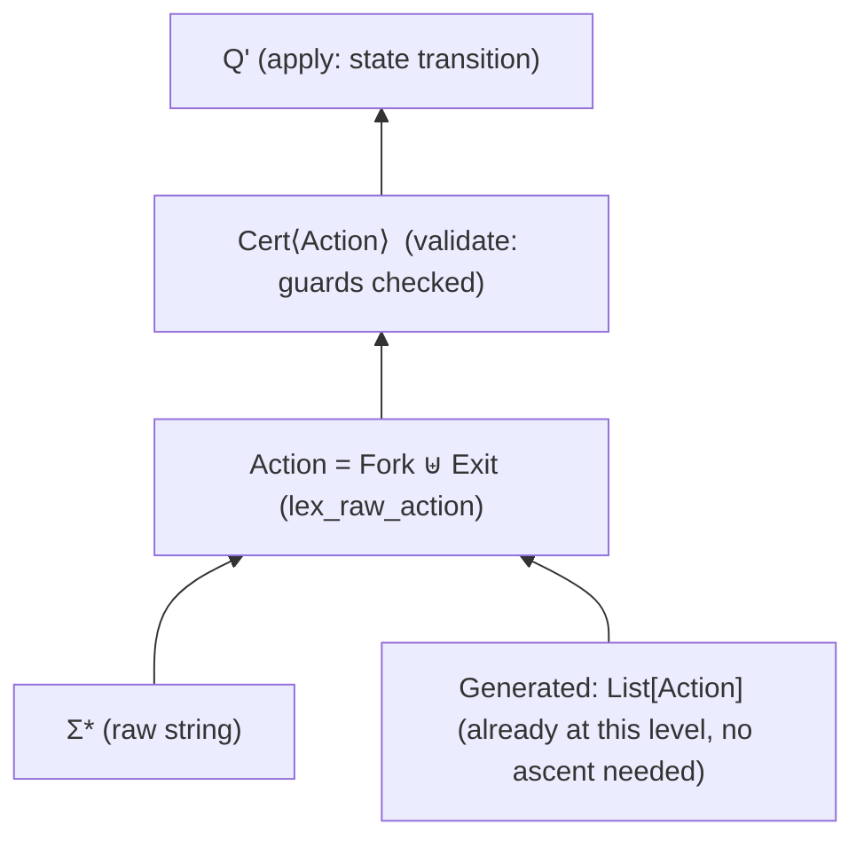

**Intent, named precisely:** you want the **refinement poset** of representations `check_legal`/`Action` produce, in both designs, exhibited as Hasse diagrams — then the "parse, don't validate" advantage **formalized categorically** as a fact about *factorization systems* and *subobjects*, not just asserted as good style.

---

### 1. The poset itself

Define $(\text{Repr}, \sqsubseteq)$: for representations $x, y$ of a value, $x \sqsubseteq y$ iff **every predicate provable from $y$ alone (no re-inspection) is also provable from $x$ alone** — i.e. $y$ carries *at least as much statically-known information* as $x$. This is exactly a **subtyping/refinement order**: reflexive, transitive, and (up to representation-equivalence) antisymmetric — a genuine poset.

The relevant elements, from least to most informative:

$$\Sigma^* \;\sqsubseteq\; \Sigma^* \times \mathbf{Bool} \;\sqsubseteq\; \text{List}[\text{str}]_{\text{tagged-by-len}} \;\sqsubseteq\; \text{Action} \;\sqsubseteq\; \text{Cert}\langle\text{Action}\rangle$$

- $\Sigma^*$ — raw string, no proof of anything.
- $\Sigma^* \times \mathbf{Bool}$ — "validated" style: a boolean witness *exists at runtime* but is not woven into the type, so it can be discarded/ignored by any downstream consumer.
- $\text{List}[\text{str}]_{\text{tagged-by-len}}$ — your original `check_legal`: marginally above raw validation because a split occurred, but the discriminant is *runtime cardinality*, not a type — so, critically, it does **not** actually dominate $\Sigma^* \times \mathbf{Bool}$ in any way a type checker can see.
- $\text{Action} = \text{Fork} \uplus \text{Exit}$ — the coproduct; the discriminant is now a *constructor tag*, checkable exhaustively by the compiler/pattern-matcher.
- $\text{Cert}\langle\text{Action}\rangle$ — carries proof that state-guards were also checked; top element in this chain.

### 2. Old design — Hasse diagram

The dotted arrow is the point: **the poset has a ceiling**. `List[str]` never climbs to `Action` — every caller (`run()`'s `if len(tmp) == 2`) has to *independently re-derive* the tag by inspecting cardinality. Two callers, two redundant proofs of the same fact, with no shared object certifying it once.

### 3. New design — Hasse diagram

Both sources — `RawCLI` and `Generated` — **join at $\text{Action}$**, a single shared object, then ascend together through one `validate` and one `apply`. No caller downstream of $\text{Action}$ ever re-inspects a string or a length again.

---

### 4. Formalizing the advantage: factorization systems

Category-theoretically, this is exactly the difference between having, or lacking, an **$(E,M)$-factorization** of the map $\text{check}: \Sigma^* \to \mathbf 1$ (the original "yes/no, and maybe crash" check).

Every function $f : X \to Y$ that both **filters** and **transforms** can, in principle, be factored as
$$X \twoheadrightarrow I \rightarrowtail Y$$
— an epimorphism (surjection onto the *image*) followed by a monomorphism (an honest inclusion of that image into $Y$). The image object $I$ is the **reified evidence** that $f$'s filtering step happened, sitting as a genuine object in the category — not a side-effect, not a runtime flag.

- **Validate-only** (`Σ* × Bool`, or `exit(1)` on failure) computes the epi part — "does this element belong to the good subset?" — but **never constructs $I$ as an object**. The information is produced and immediately discarded into a boolean or a process-kill; nothing downstream can hold a value of type $I$, so nothing can be *typed against* the fact that filtering occurred.
- **Parse-don't-validate** (`Action`, and `Cert<Action>`) makes $I$ real: $\text{Action} \rightarrowtail \Sigma^*_{\text{well-formed actions}}$ *is* the mono half of the factorization, materialized as a Python/Rust type. Once you hold a value of type `Action`, you are, by construction, holding a proof that you're in the image — you cannot construct an `Action` any other way, so possessing one **is** the certificate.

This is precisely why re-inspection becomes structurally impossible rather than merely discouraged: a `match` on `Fork`/`Exit` is a case analysis over the **generators of the coproduct**, which is exhaustive and total by the universal property of $\uplus$; a check on `len(tmp)` is testing membership in an unenumerated, unclosed set of integers, where nothing stops a third shape from appearing that no one branch accounts for.

### 5. The Galois-connection framing (why the poset matters, not just the factorization)

$\sqsubseteq$ from Part 1 and the factorization system are the same fact seen two ways: **moving up the poset = choosing a factorization with a richer image object $I$.** The old design's ceiling at `List[str]` is exactly the statement "no factorization of `check_legal` through a proper sum-type image was ever constructed" — the epi happened (the split occurred), but no mono target existed to land in, so the poset simply has no element there to ascend to. Adding `Action` doesn't just rename a return type; it **adds a new top element to the poset that wasn't representable before**, and every subsequent design decision (`Cert<Action>`, guarded `apply`) is climbing further up a lattice that literally didn't exist in the original code.