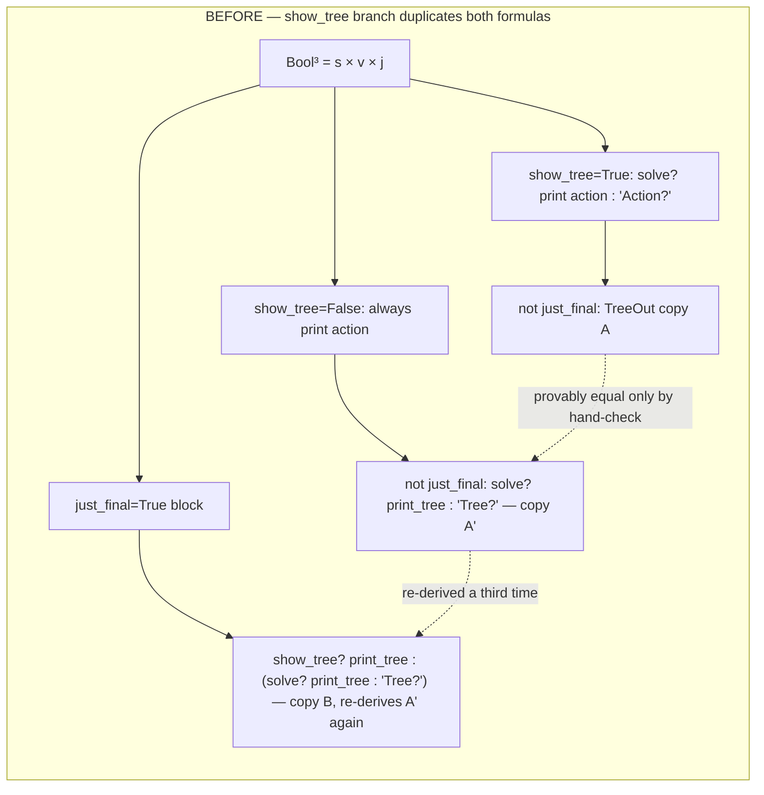
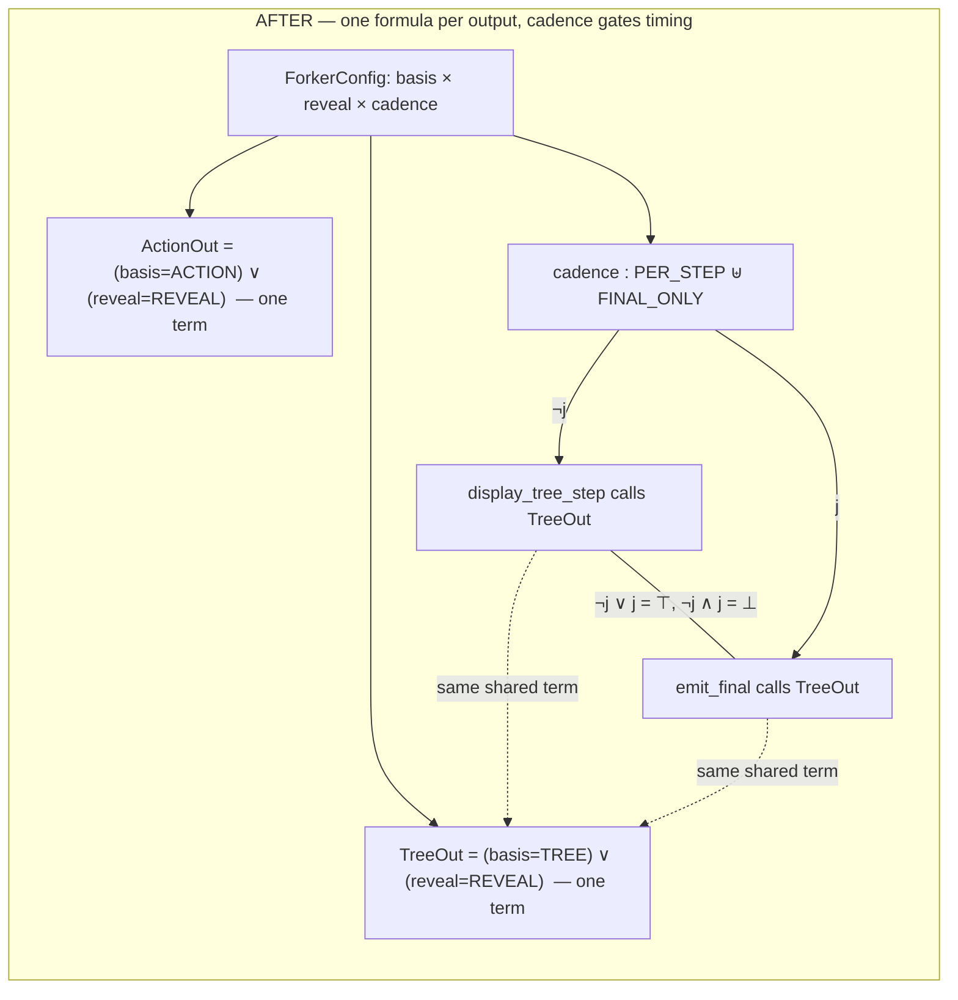

**Before**: the tree-display rule is written out three separate times (`show_tree=True`, `show_tree=False`, and the trailing `just_final` block), and only hand-verification — the proof from a few messages back — establishes they're the same term; nothing in the code enforces that.

**After**: `TreeOut` is a single function `display_tree_step`/`emit_final` both call. `TelemetryCadence` doesn't add a fourth copy of the logic — it's a genuine partition ($\lnot j \lor j = \top$, disjoint) of *when* the one shared term fires, not a new instance of the term itself.