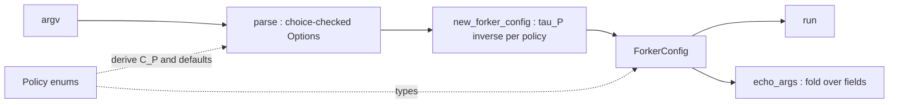

**Intent:** *boundary re-typing (parse, don't validate)*. The CLI vocabulary becomes a function of the policy enums, so `parse` and `main` depend on the enums and no longer on the old booleans.

## L1: Goal and invariant

Each policy enum $P$ gets a CLI vocabulary $C_P$ and a bijection $\tau_P$ between them:

$$C_P=\{\mathrm{lower}(\mathrm{name}(m)) : m\in P\},\qquad \tau_P:P\xrightarrow{\ \cong\ }C_P$$

With this design, the whole boundary is a product of bijections:

$$\texttt{new\_forker\_config}=\mathrm{id}_{\mathbb{R}\times\mathbb{N}\times\Sigma^*}\;\times\;\prod_{P}\tau_P^{-1}$$

- **Total, with no error branch.** `optparse`'s `type='choice'` restricts each parsed value to $C_P$. The inverse $\tau_P^{-1}$ is therefore total on the parse image, and no `KeyError` path exists.
- **One source of truth.** $C_P$ is computed from $P$, so adding a member to an enum updates the CLI automatically. Setting `dest` to the long-flag name also stops `dest` from drifting from the `ForkerConfig` field names.
- **The old CLI was weaker.** `-L` and `-R` were bits meaning "not the default", so you had to know which member was the default. `--print_style` was an unchecked $\Sigma^*$ that only failed deep inside `walk`. The new flags name the member directly and reject bad values at the boundary.



## L2: Decisions

1. **Flag names.** Each long flag equals its `ForkerConfig` field name.
2. **Defaults.** Defaults are enum members, converted by `token_of`, so there is no second copy of the default.
3. **ARG echo.** It reads from `ForkerConfig`, the record the program actually runs on, instead of `options`. It iterates `fields(config)`, so a new field appears in the echo without another edit.
4. **`-a` dest.** `-a` now uses `dest='max_actions'`, which makes the options record match the config field names.
5. **Seed.** `seed` stays in `options`, because it is an effect on the global RNG and not part of the config.

## L3: Code

Add `fields` to the dataclasses import, and `Type, TypeVar` to the typing import:

```python
from dataclasses import dataclass, replace, fields
from typing import Dict, List, Tuple, NewType, Union, Type, TypeVar
```

**Vocabulary maps (tau and its inverse):**

```python
P = TypeVar("P", bound=Enum)

def token_of(member: Enum) -> str:
    """P -> C_P"""
    return member.name.lower()

def choices_of(policy: Type[P]) -> List[str]:
    """C_P as the finite set optparse enforces"""
    return [token_of(member) for member in policy]

def policy_of(policy: Type[P], token: str) -> P:
    """C_P -> P, the inverse of token_of. Total on optparse's output."""
    return policy[token.upper()]

def show_arg(value: object) -> str:
    return value.name if isinstance(value, Enum) else str(value)
```

**parse:**

```python
def add_policy_option(parser: OptionParser, short: str, long: str, policy: Type[P], default: P, help: str) -> None:
    parser.add_option(
        short, long,
        action='store', type='choice',
        choices=choices_of(policy),
        default=token_of(default),
        dest=long.lstrip('-'),          # dest == ForkerConfig field name
        help=help + ' [default: %default]',
    )

def parse(args: List[str]) -> Tuple[object, List[str]]:
    parser = OptionParser()
    parser.add_option('-s', '--seed', default=-1, help='the random seed', action='store', type='int', dest='seed')
    parser.add_option('-f', '--forks', default=0.7, help='fraction of actions that are forks (not exits)', action='store', type='float', dest='fork_percentage')
    parser.add_option('-a', '--actions', default=5, help='number of forks/exits to do', action='store', type='int', dest='max_actions')
    parser.add_option('-A', '--action_list', default='', help='action list instead of random ones (format: a+b,b+c,b- means a fork b, b fork c, b exit)', action='store', type='string', dest='action_list')

    add_policy_option(parser, '-B', '--telemetry_basis',         TelemetryBasis,        TelemetryBasis.ACTION,          'which side is shown unmasked')
    add_policy_option(parser, '-V', '--telemetry_reveal_policy', TelemetryRevealPolicy, TelemetryRevealPolicy.MASK,     'reveal or mask the non-basis side')
    add_policy_option(parser, '-T', '--telemetry_timing_policy', TelemetryTimingPolicy, TelemetryTimingPolicy.PER_STEP, 'display every step (scan) or only the end (fold)')
    add_policy_option(parser, '-L', '--exit_node_policy',        ExitNodePolicy,        ExitNodePolicy.ANY_PROCESS_MAY_EXIT, 'which processes may exit')
    add_policy_option(parser, '-R', '--reparent_policy',         ReparentPolicy,        ReparentPolicy.GLOBAL_TO_PARENT,     'where orphans go on exit')
    add_policy_option(parser, '-P', '--print_style_policy',      PrintStylePolicy,      PrintStylePolicy.FANCY,              'tree print style')

    (options, parsed_args) = parser.parse_args(args)
    return options, parsed_args
```

**new_forker_config** (pure, componentwise, no state constructed):

```python
def new_forker_config(options) -> ForkerConfig:
    return ForkerConfig(
        fork_percentage=options.fork_percentage,
        max_actions=options.max_actions,
        action_list=options.action_list,
        telemetry_basis=policy_of(TelemetryBasis, options.telemetry_basis),
        telemetry_reveal_policy=policy_of(TelemetryRevealPolicy, options.telemetry_reveal_policy),
        telemetry_timing_policy=policy_of(TelemetryTimingPolicy, options.telemetry_timing_policy),
        exit_node_policy=policy_of(ExitNodePolicy, options.exit_node_policy),
        reparent_policy=policy_of(ReparentPolicy, options.reparent_policy),
        print_style_policy=policy_of(PrintStylePolicy, options.print_style_policy),
    )
```

**main:**

```python
def echo_args(seed: int, forker_config: ForkerConfig) -> None:
    print('')
    print('ARG seed', seed)
    for field in fields(forker_config):
        print('ARG', field.name, show_arg(getattr(forker_config, field.name)))
    print('')

def main():
    (options, _) = parse(sys.argv[1:])
    forker_config = new_forker_config(options)

    # Pre-run assertions, on the config the run will actually use
    if forker_config.fork_percentage <= 0.001:
        print('fork_percentage must be > 0.001')
        exit(1)

    # Effect on the global RNG; seed is not part of ForkerConfig
    if options.seed != -1:
        random_seed(options.seed)

    run(forker_config)
    echo_args(options.seed, forker_config)
```

**Required companion edit:** `ForkerConfig` must have `solve: bool` deleted, as decided in the previous turn. Otherwise `new_forker_config` raises a missing-argument `TypeError`. Change `fork_percentage: int` to `float` while you are there.

## L4: Old to new invocation

| Old | New | New default |
|---|---|---|
| `-t` | `-B tree` | `action` |
| `-c` | `-V reveal` | `mask` |
| `-F` | `-T final_only` | `per_step` |
| `-L` | `-L only_leaves_may_exit` | `any_process_may_exit` |
| `-R` | `-R local_to_parent` | `global_to_parent` |
| `-P fancy` | `-P fancy` (long flag is now `--print_style_policy`) | `fancy` |
| `-A` | `-A` (long flag is now `--action_list`) | empty |

The new defaults match what the old defaults meant, so a bare invocation behaves the same.

I can fold these into the full patched file and run it across the flag combinations, if you'd like.