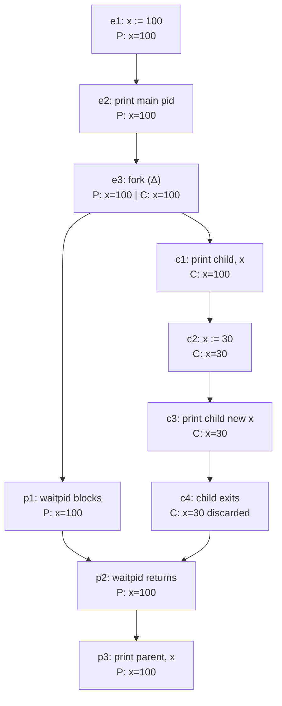

# Goal → decision → model

**Goal:** determine the value of `x` observable in each process at each event, and the ordering constraints between events.

**Decision:** two structures are needed. A **partial order of events** (Lamport happens-before) captures causality. A **state assignment** (a function from events to the process-local value of `x`) captures memory. `fork` copies the address space, so the state is a **product** over processes, not a shared cell.

## 1. Event poset (Hasse diagram, covering relations only)

The shape is a **diamond**: a fork at `e3`, two independent chains, and a join at `p2`.

## 2. Formalization

**Set-theoretic (event poset).** Let

$$E=\{e_1,e_2,e_3,c_1,c_2,c_3,c_4,p_1,p_2,p_3\},\qquad \Pi=\{P,C\}$$

Let $\preceq$ be the reflexive-transitive closure of the covering relations in the diagram. Then $(E,\preceq)$ is a poset. The process-ownership map is

$$\pi:E\to\Pi,\qquad \pi(c_i)=C,\quad \pi(p_i)=P,\quad \pi(e_i)=P$$

Two events are **concurrent** iff they are incomparable:

$$e\parallel e' \iff e\not\preceq e' \wedge e'\not\preceq e$$

The maximal antichains are $\{c_i,p_1\}$ for $i=1,\dots,4$. The only cross-process orderings are $e_3\preceq c_1$ (fork) and $c_4\preceq p_2$ (wait).

**Categorical (state semantics).** Take the state set $X=\mathbb{Z}$ for the value of `x`, and work in the cartesian category $\mathbf{Set}$.

$$\text{fork}=\Delta:X\to X\times X,\qquad \Delta(x)=(x,x)$$

$$\text{child write}=\mathrm{id}_X\times \kappa_{30}:X\times X\to X\times X,\qquad (x_P,x_C)\mapsto(x_P,30)$$

$$\text{wait}=\pi_1:X\times X\to X,\qquad (x_P,x_C)\mapsto x_P$$

Composing along the diamond:

$$\pi_1\circ(\mathrm{id}_X\times\kappa_{30})\circ\Delta\,(100)=\pi_1(100,30)=100$$

So the parent's `x` is unchanged. The write only touches the second coordinate of the product. Address-space isolation is exactly the statement that the state lives in $X_P\times X_C$, not in a single $X$ with two writers. `waitpid` is a synchronization that adds an order edge, but it does not merge state, because $\pi_1$ discards the child coordinate.

**Order-theoretic consequence.** The prints are $c_1\prec c_3\prec c_4\prec p_2\prec p_3$, a chain. So the observable output order is **deterministic** even though $p_1$ is concurrent with the child. The join at $p_2$ forces all child prints before the parent print.

## 3. Resulting trace

| Event | Process | `x` in P | `x` in C |
|---|---|---|---|
| e2 | P | 100 | not yet created |
| e3 | P → P,C | 100 | 100 |
| c1 | C | 100 | 100 |
| c2, c3 | C | 100 | 30 |
| p3 | P | 100 | gone |

Output order: `main pid` → `child pid … x: 100` → `child new x: 30` → `parent pid … x: 100`.

## Two caveats

- **The commented-out `os._exit(0)` changes nothing here.** Nothing follows the `if/else`, so the child returns from `question1`, then `main`, then exits normally, and it never reaches the parent branch. It would matter if there were code after the branch (the child would run it too), or if you wanted to skip interpreter cleanup.
- **Buffered stdout can duplicate `main pid`.** If stdout is piped or redirected instead of a TTY, it is block-buffered. The pre-fork print sits in the buffer, gets copied into the child's address space by $\Delta$, and is flushed twice. The buffer is part of the state, so the model is really $X\times B$, where $B$ is the buffer contents, and $\Delta$ copies both. Adding `flush=True` to the first print removes the duplicate.