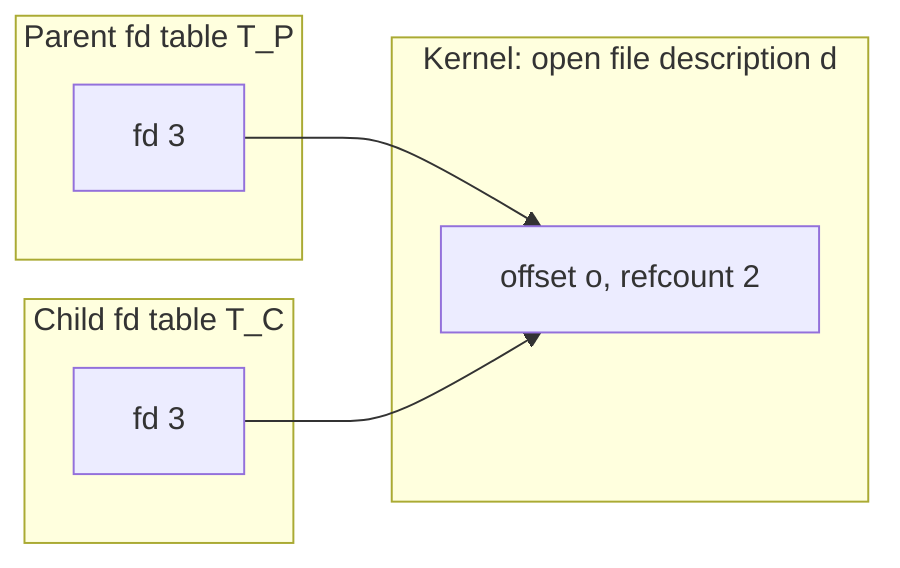
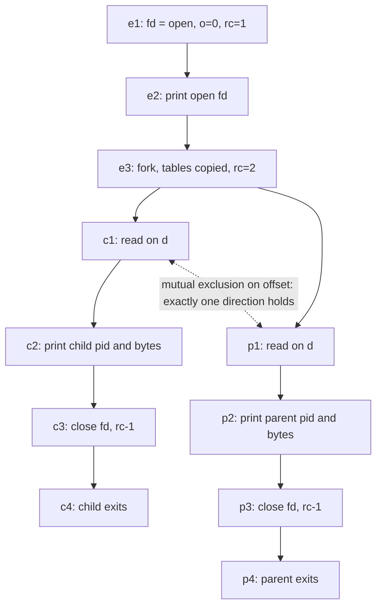

# Goal → decision → model

**Goal:** determine which values each process observes from `read`, and which orderings are forced versus merely possible.

**Decision:** the Q1 model (state as a product over processes) fails here, so the first question is what `fork` copies. In Q1, `x` was a **value** in each process's address space, so $\Delta$ duplicated the value. Here, `fd` is a **reference** into a kernel-side object, so $\Delta$ duplicates the reference and leaves the referent shared. The state is a shared cell behind two pointers, not a product. Order then splits into a forced part (program order, fork) and a resolved part (the kernel serializing access to the shared cell).

## 1. State structure: references versus referents

Three kernel-level sets matter:

- $\mathrm{FD}=\mathbb{N}$: descriptor numbers, which are per-process.
- $D$: open file descriptions, which are kernel objects.
- $\mathrm{Off}:D\to\mathbb{N}$: the offset stored inside each description.

Each process $p\in\{P,C\}$ has a table $T_p:\mathrm{FD}\rightharpoonup D$.

Fork acts on the tables only:

$$\text{fork}:\ (T,\mathrm{Off})\ \mapsto\ \big((T,T),\ \mathrm{Off}\big)$$

Both tables satisfy $T_P(3)=T_C(3)=d$, so both descriptors form a **pullback over the same $d$**:

$$T_P(3)\ \times_D\ T_C(3)\;=\;\{(a,b)\mid a=b=d\}\cong 1$$

In Q1 the analogous square had two distinct target cells, so the write was isolated. Here the target is a single cell, so it is not.

## 2. Effect semantics: `read` is a state-monad action on $\mathrm{Off}$

Let the file contents be a word $w\in\mathrm{Byte}^*$ with length $n$. Then

$$\mathrm{read}_{100}:\ \mathrm{Off}(d)=o\ \longmapsto\ \big(w[o:o+100],\ \ o'=\min(o+100,\,n)\big)$$

This is a Kleisli arrow of the state monad $S\Rightarrow(A\times S)$ over the shared cell $o$. Two consequences:

- **Reads do not commute in their observations.** $r_P\circ r_C$ and $r_C\circ r_P$ hand the same two chunks to the readers in swapped order.
- **Reads commute in their final state.** Both orders end with $o=\min(200,n)$.
- **Closes commute.** Each close decrements the refcount, and the decrements commute, so the last one frees $d$ regardless of order.

## 3. Event poset (Hasse diagram)

Set-theoretically, let $E=\{e_1,e_2,e_3,c_1,\dots,c_4,p_1,\dots,p_4\}$. The **forced** order $\preceq_0$ is the reflexive-transitive closure of the solid edges. It is a fork shape with **no join**, because there is no `waitpid`. That is the structural difference from Q1's diamond.

Under $\preceq_0$, the two branches are fully concurrent:

$$\{c_1,\dots,c_4\}\ \parallel\ \{p_1,\dots,p_4\}$$

The dashed edge is not an edge of $\preceq_0$. The kernel holds a lock on the shared offset, so the reads $c_1$ and $p_1$ are atomic and mutually exclusive. Formally, the actual order is one of two extensions:

$$\preceq_A=\preceq_0\cup\{(p_1,c_1)\},\qquad \preceq_B=\preceq_0\cup\{(c_1,p_1)\}$$

Both are valid, and which one occurs is determined by the scheduler. So the model is a **set of posets**, one per scheduling outcome.

## 4. Observable outcomes

The `read` runs during argument evaluation, before either `print` emits anything. That makes the read order and the print order independent choices:

$$\text{read order}\in\{A,B\}\ \times\ \text{print order}\in\{c_2\prec p_2,\ p_2\prec c_2\}$$

That gives four possible traces. With $w_1=w[0{:}100]$ and $w_2=w[100{:}200]$:

| Read order | Parent gets | Child gets | Final offset |
|---|---|---|---|
| $\preceq_A$ (parent first) | $w_1$ | $w_2$ | $\min(200,n)$ |
| $\preceq_B$ (child first) | $w_2$ | $w_1$ | $\min(200,n)$ |

Each of the two rows can appear with either print order. The two edge cases are:

- **Short file ($n<100$):** whichever process reads first gets all of $w$, and the other gets `b''`. A read at $o=n$ is EOF.
- **Nonempty output for exactly one process:** this is a clean signature that the offset is shared. Isolated state, as in Q1, would give both processes $w_1$.

## 5. Contrast with Q1 in one line

$$\text{Q1: }\ \mathrm{state}=X_P\times X_C\ \ (\text{values copied})\qquad\text{Q2: }\ \mathrm{state}=(T_P,T_C)\rightrightarrows D\ \ (\text{references copied, referent shared})$$

## 6. Caveats

- **No `waitpid` means no termination order.** The parent can exit, and the shell can return its prompt, before the child prints. The child is reparented to init and still runs, so its output can appear after the prompt.
- **`os.close(fd)` closes only that process's table entry.** The description $d$ is freed when its refcount reaches 0, that is, after both closes. The offset persists until then.
- **The stdout buffer issue from Q1 still applies.** With piped output, `open fd:` can be duplicated by $\Delta$ on the buffer.
- **Locking of the shared offset is a kernel guarantee, not a Python one.** Linux serializes concurrent `read`s on a shared regular-file offset (the `f_pos` lock), so two reads cannot both receive $w_1$. Portable code should not rely on it. The safe alternative is `os.pread(fd, 100, offset)`, which does not touch the shared offset, so the reads commute and the ordering ambiguity disappears.