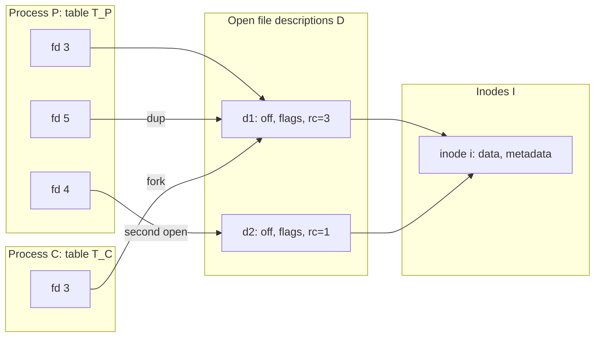

# Goal → decision → model

**Goal:** define the kernel objects behind an `fd` precisely enough to predict what is shared, what is copied, and what is independent under `open`, `dup`, `fork`, and threads.

**Decision:** a file descriptor is not a file. It is the first of three levels of indirection, and each level owns different state. Once you know which level owns which attribute, every sharing question reduces to asking whether two references land on the same object at that level.

## 1. The three levels (sets and maps)

| Level | Linux object | Cardinality | Owns |
|---|---|---|---|
| Slot | entry in `files_struct` fd table | one per (process, fd) | fd number, close-on-exec flag |
| Open file description | `struct file` | system-wide | offset, status flags (`O_APPEND`, `O_NONBLOCK`), access mode, ops vtable |
| Inode | `struct inode` | one per file object | data, size, permissions, timestamps |

Each process $p$ has a partial map $T_p:\mathbb{N}\rightharpoonup D$, where $D$ is the set of open file descriptions. The description carries three maps:

$$\mathrm{off}:D\to\mathbb{N},\qquad \mathrm{ino}:D\to I,\qquad \mathrm{ops}:D\to\mathrm{Ops}$$

Let $S=\{(p,n)\mid p\in\text{Proc},\ n\in\mathrm{dom}(T_p)\}$ be the set of all live slots, and define the evaluation map

$$\mathrm{ev}:S\to D,\qquad \mathrm{ev}(p,n)=T_p(n)$$

A process-and-descriptor pair resolves to a file through a composite in $\mathbf{Set}$:

$$S\xrightarrow{\ \mathrm{ev}\ }D\xrightarrow{\ \mathrm{ino}\ }I$$

The map $\mathrm{ops}$ is why `read` on a socket, pipe, or regular file all go through the same call. The kernel dispatches through the description's vtable, so the description is the point of polymorphism.

## 2. Sharing is a kernel pair, and refcount is a fiber size

Two slots share a description exactly when they are related by the **kernel pair** of $\mathrm{ev}$, the pullback of $\mathrm{ev}$ along itself:

$$R_D=S\times_D S=\{(s,s')\in S^2\mid \mathrm{ev}(s)=\mathrm{ev}(s')\}$$

It is an equivalence relation, and its classes are the fibers of $\mathrm{ev}$. The reference count is the size of a fiber:

$$\mathrm{rc}(d)=\big|\mathrm{ev}^{-1}(d)\big|$$

In the model, `close` removes one element from $S$, which shrinks one fiber by one. The description is freed when its fiber becomes empty. (Real Linux also holds transient references, for example during an in-flight `read`, so $\mathrm{rc}(d)\ge|\mathrm{ev}^{-1}(d)|$. The fiber model gives the steady-state count.)

Composing with $\mathrm{ino}$ gives a coarser relation:

$$R_I=\ker(\mathrm{ino}\circ\mathrm{ev}),\qquad \Delta_S\ \subseteq\ R_D\ \subseteq\ R_I$$

This is a chain in the refinement order of partitions of $S$: identical slot $\sqsubseteq$ same description $\sqsubseteq$ same inode. Each level of the chain shares exactly the state owned at that level in the table above. This one chain answers every sharing question.

## 3. Operations as morphisms



| Operation | Effect on tables | Effect on $D$ | Relations affected |
|---|---|---|---|
| `open(path)` | $T_p(n_{\min}):=d_{\text{new}}$ | allocates $d_{\text{new}}$, $\mathrm{off}=0$ | new class in $R_D$, joins $R_I$ class of the path's inode |
| `dup(n)` / `dup2` | $T_p(m):=T_p(n)$ | none | $(p,m)\,R_D\,(p,n)$ |
| `fork` | $T_c:=T_p$ (copied map) | none | every slot of $p$ is now $R_D$-related to its copy |
| `close(n)` | $T_p:=T_p\setminus\{n\}$ | frees $d$ if fiber empties | shrinks a class |
| `exec` | drops slots with close-on-exec | possibly frees | shrinks classes |
| `read`/`lseek` | none | updates $\mathrm{off}(d)$ | none |

`open` picks the lowest unused number, which is why a fresh process usually gets 3 (0, 1, 2 are stdio).

Two distinct `open` calls on the same path give distinct descriptions with the same inode. They are $R_I$-related but not $R_D$-related, so their offsets are independent. `dup` and `fork` are $R_D$-related, so their offsets are shared. This is the exact difference between Q2's fork and reopening the file in the child.

## 4. Where each attribute lives

The common mistake is putting a per-description attribute on the descriptor.

- **Per slot (private to the fd number):** close-on-exec (`FD_CLOEXEC`). Set with `fcntl(F_SETFD)`. `dup` does not copy it, and it can differ between two aliases of the same description.
- **Per description (shared across `dup` and `fork`):** offset, `O_APPEND`, `O_NONBLOCK`, access mode. Set with `fcntl(F_SETFL)`. Setting `O_NONBLOCK` through the parent's fd also makes the child's fd non-blocking.
- **Per inode (shared across all opens):** contents, size, mode, mtime.

## 5. Connection to your earlier GIL question: copy versus share of the table itself

The table $T$ is also an object, and the clone flags decide whether it is copied or shared.

- **`fork`** (no `CLONE_FILES`): $T_c$ is an equal but distinct copy. Later `close` or `open` in one process does not affect the other's table, but descriptions stay shared.
- **`pthread_create`** (`CLONE_FILES`): threads reference the same `files_struct`, so $T$ is a single object. An `open` in one thread appears in every other thread of that process.

That gives two levels of "shared." Threads share the table, so even the slots are shared. Forked processes share only descriptions. This is the structural reason threads see each other's new descriptors while a forked child does not.

## 6. Consequences for Q2

- The shared offset is per-description state, so parent and child contend on one cell, as modeled before.
- Linux serializes `read` and `write` on a shared regular-file offset with a per-file position lock (`f_pos_lock`, since 3.14). That is why the two reads cannot both return the same chunk.
- `os.pread(fd, n, offset)` reads from an explicit offset without touching $\mathrm{off}(d)$, so it removes the shared-cell dependency entirely.
- To get independent offsets after fork, the child must `open` again (new description) or use `pread`.

A quick empirical check of the fiber model:

```python
import os
fd  = os.open("test-file.md", os.O_RDONLY)
dup = os.dup(fd)                                   # same d: shared offset
new = os.open("test-file.md", os.O_RDONLY)         # new d: independent offset

os.read(fd, 10)
print(os.lseek(dup, 0, os.SEEK_CUR))  # 10, same description
print(os.lseek(new, 0, os.SEEK_CUR))  # 0, different description
```

`fd` and `dup` land in one fiber of $\mathrm{ev}$, `new` in another, and all three share an inode.