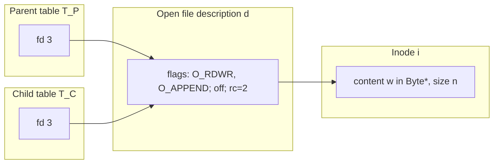
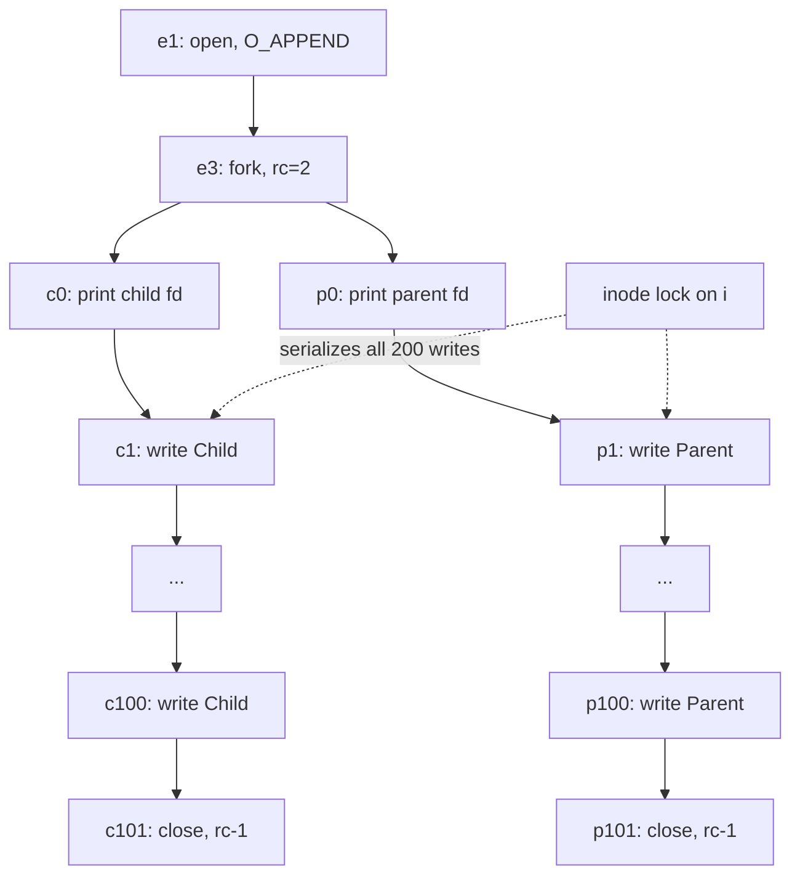

# Goal → decision → model

**Goal:** determine what the shared file contains after 200 concurrent writes, and which orderings are forced versus resolved by the kernel.

**Decision:** Q2 modeled `read` as an action on the shared offset. Here the offset is irrelevant, because `O_APPEND` makes each write's position a function of the inode's size, not of the description's offset. So the state that matters moves from the description level to the **inode level**, and the model becomes a monoid action on file contents. The question then reduces to whether each `write` is a single indivisible generator or decomposes into smaller steps.

## 1. State structure

The sharing structure is the same kernel-pair picture as Q2: fork copies the table, the description stays shared.



$$T_P(3)=T_C(3)=d,\qquad \mathrm{ino}(d)=i$$

Let $\mathrm{flags}(d)\ni\texttt{O\_APPEND}$. The write position is now

$$\mathrm{pos}(d,i)=\begin{cases}\mathrm{size}(i) & \texttt{O\_APPEND}\in\mathrm{flags}(d)\\ \mathrm{off}(d) & \text{otherwise}\end{cases}$$

`O_APPEND` is a **per-description** flag, so it applies to both processes at once. Neither process can opt out.

## 2. Effect semantics: appends form a monoid action

Let $(\mathrm{Byte}^*,\cdot,\varepsilon)$ be the free monoid on bytes, and let the file contents be $w\in\mathrm{Byte}^*$. An append of a buffer $b$ is the right action

$$\mathrm{app}_b:\ w\mapsto w\cdot b$$

Because the kernel performs seek-to-end and write as one step under the inode lock, each `os.write` is a **single generator**, not a sequence of byte-level steps. Take the alphabet of generators

$$\Sigma=\{c,p\},\qquad h:\Sigma^*\to\mathrm{Byte}^*,\quad h(c)=\texttt{Child\textbackslash n},\ h(p)=\texttt{Parent\textbackslash n}$$

where $h$ is the monoid homomorphism extending those values. The final contents are then

$$w_{\text{final}}=w_0\cdot h(\sigma),\qquad \sigma\in\mathrm{Sh}(c^{100},p^{100})$$

Here $\mathrm{Sh}$ is the set of **shuffles** (order-preserving interleavings) of the two words.

Two properties follow:

- **Order matters.** The monoid is non-commutative, so $c\cdot p\neq p\cdot c$ as words. Different shuffles give different files.
- **Counts do not.** Under abelianization $\Sigma^*\to\mathbb{N}^2$, every $\sigma$ maps to $(100,100)$. So the number of `Child` lines, the number of `Parent` lines, and the total size increase are invariant across all schedules:

$$|w_{\text{final}}|=|w_0|+100\cdot 6+100\cdot 7=|w_0|+1300$$

## 3. Event poset



Let $W_C=\{c_1,\dots,c_{100}\}$ and $W_P=\{p_1,\dots,p_{100}\}$. The **forced** order $\preceq_0$ is the closure of the solid edges. It is a fork with **no join** (no `waitpid`), and it has two chains inside it:

$$c_1\prec\dots\prec c_{100},\qquad p_1\prec\dots\prec p_{100},\qquad W_C\parallel W_P\ \text{under }\preceq_0$$

The inode lock adds edges that turn $W_C\cup W_P$ into a **total order**. Each admissible total order is a linear extension of the disjoint union of two 100-chains, which is exactly a shuffle:

$$\big|\mathrm{Sh}(c^{100},p^{100})\big|=\binom{200}{100}$$

So the model is again a **set of posets**, one per schedule, but now each element is a total order on writes, and there are $\binom{200}{100}$ of them. What is fixed across all of them:

- Program order inside each process, that is, the subsequence of $c$'s and the subsequence of $p$'s are each in order.
- The line multiset $(100,100)$.
- Line integrity, that is, every line is exactly `Child\n` or `Parent\n`.

## 4. What the guarantee is, and what it is not

The atomicity claim is that $\mathrm{app}_b$ is one step. Without it, the alphabet would be individual bytes, and the shuffle would be over byte chains:

$$\mathrm{Sh}\big(h(c)^{100},\,h(p)^{100}\big)\ \supsetneq\ h\big(\mathrm{Sh}(c^{100},p^{100})\big)$$

The extra elements would include torn lines such as `ChParent\nild\n`. The inode lock rules those out, so the reachable set is the strictly smaller image of line-level shuffles.

`O_APPEND` and the shared description guard against different failures:

| Configuration | Position source | Race | Outcome |
|---|---|---|---|
| Shared description, `O_APPEND` (this code) | inode size, under lock | none | line-level shuffle |
| Shared description, no `O_APPEND` | shared `off(d)`, under `f_pos_lock` | none on Linux | also no overwrite, offset advances atomically |
| **Separate `open`s, no `O_APPEND`** | two independent offsets | **lost update** | later writes overwrite earlier bytes at the same position |
| Separate `open`s, `O_APPEND` | inode size, under lock | none | same as this code |

So in this specific program the fork-shared description would already prevent overwriting on Linux. `O_APPEND` becomes essential once processes hold **different descriptions**, which is the $R_I$-related but not $R_D$-related case from the previous answer. It is also what makes the guarantee hold if you later replace `fork` with independent `open` calls.

## 5. Observable outcomes

- **Line count:** exactly 200 new lines, 100 of each kind.
- **Order:** any of the $\binom{200}{100}$ shuffles. In practice, short loops on a multicore machine often produce long runs of one process, since each process may finish many writes per scheduler quantum. Do not treat runs as guaranteed or as evidence that the order is fixed.
- **Prints:** `child fd:` and `parent fd:` are concurrent and unordered, and the stdout flush timing is independent of the file writes because they go through different channels.
- **No join:** the parent may exit first and the shell may return before the child finishes.

A quick empirical check:

```python
from collections import Counter

with open("concurrent-write.md", "rb") as f:
    lines = f.read().splitlines()

print(Counter(lines))  # expect Child: 100 and Parent: 100 above the baseline, with no other line variants
```

If any line is neither `Child` nor `Parent`, atomicity has been violated.

## 6. Caveats

- **The file must already exist.** `O_RDWR | O_APPEND` without `O_CREAT` raises `FileNotFoundError`.
- **Atomicity is a property of local regular files on Linux.** POSIX specifies that `O_APPEND` positioning and write occur atomically, but it does not fully specify concurrent-write interleaving for arbitrary sizes. On **NFS**, `O_APPEND` atomicity is not guaranteed. For pipes, atomicity is guaranteed only up to `PIPE_BUF` (4096 bytes on Linux). These 6 and 7 byte writes are well under any such limit.
- **`os.write` can return a short count** in general. For small writes to a local regular file it does not in practice, but robust code loops on the return value. A short write would split a generator into two, which is precisely the torn-line case above.
- **No `waitpid`.** Adding `os.waitpid(pid, 0)` in the parent after its loop would add a join edge $c_{101}\preceq p_{\text{post}}$ and make the final read-back deterministic in count, though not in shuffle order.