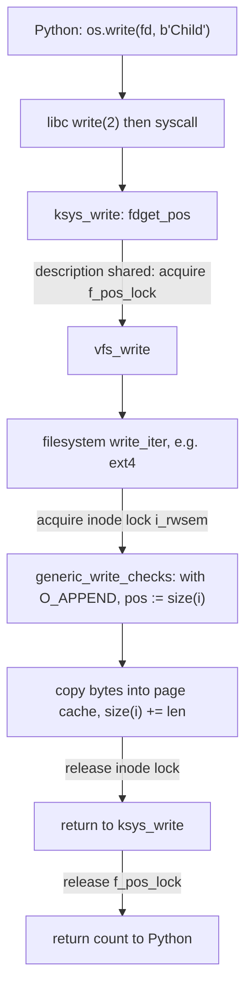

# Goal → decision → answer

**Goal:** locate the acquisition point of the lock in the source and in the call path.

**Decision:** separate the *Python line that triggers* the lock from the *kernel code that takes* it. No line of your Python names a lock. The lock is a side effect of a system call, so the question becomes which syscall performs the acquire.

**Answer:** the only lines that reach a lock are the two `os.write(...)` lines, inside the loops. Each call is one full acquire → critical section → release cycle. `os.open`, `os.fork`, `os.close`, and `print` do not touch either lock relevant here. `print` goes through a different channel, the stdout buffer.

## 1. Two locks on the path, not one

My earlier answers said "inode lock". More precisely there are two locks with different owners, matching the levels from the fd-table discussion:

| Lock | Owned by | Guards | Taken when |
|---|---|---|---|
| `f_pos_lock` | open file description $d$ | $\mathrm{off}(d)$ | the description is shared, i.e. its fiber has more than one slot (here after `fork`) |
| `i_rwsem` (inode lock) | inode $i$ | contents $w$ and $\mathrm{size}(i)$ | the filesystem's write path, always |

The acquisitions nest: $\texttt{f\_pos\_lock}$ is taken first and released last, and $\texttt{i\_rwsem}$ is taken and released inside it. The fixed nesting order is what prevents deadlock.

## 2. Which lock provides which guarantee

- **Append atomicity comes from the inode lock.** Inside the critical section, `generic_write_checks` resolves the position as $\mathrm{size}(i)$ and the bytes are written before release. So "seek to end, then write" is one indivisible step, which is what makes $\mathrm{app}_b$ a single generator in the monoid model.
- **`f_pos_lock` is redundant for this program's correctness.** With `O_APPEND` the offset is not used to choose the write position. It matters for non-append writes and for `read`, as in Q2.
- **The inode lock alone suffices when the processes hold different descriptions.** With separate `open`s there is no shared description, so `f_pos_lock` is never contended, and `O_APPEND` plus the inode lock still serializes the writes. This is why `O_APPEND` is the portable guarantee here.

## 3. What order the lock induces

For each lock $L$, let $\mathrm{Acq}_L$ be its set of critical-section events. The lock makes $\mathrm{Acq}_L$ a chain, but does not choose which chain. The chosen order is the scheduler's outcome:

$$\big(W_C\cup W_P,\ \preceq_0\cup\ \text{lock order}\big)\ \text{is a total order},\qquad \text{one of }\tbinom{200}{100}\text{ possibilities}$$

Since program order is already in $\preceq_0$, each lock-order choice is a shuffle, as in the last answer.

## 4. Connection to the GIL question

`os.write` releases the GIL around the syscall. That is irrelevant to ordering here, since there is one thread per process and the two processes have separate GILs. The serialization of the two writers is provided entirely by the kernel lock, which is the one lock they genuinely share.

## 5. Caveats

- **Lock details are version- and filesystem-dependent.** The names above are Linux internals (`fdget_pos`, `i_rwsem`), and the exact conditions for taking `f_pos_lock` changed across kernel versions. Some filesystems (NFS, FUSE, network filesystems) use different write paths, and append atomicity is not guaranteed there.
- **This is kernel mutual exclusion, not file locking in the user-facing sense.** `flock` and `fcntl` locks are advisory, are taken by explicit calls, and would appear as their own line in your code. Your program has none, so it relies entirely on the implicit kernel locks.
- **Locks give exclusion, not fairness.** Nothing guarantees alternation. Long runs of one process are expected.