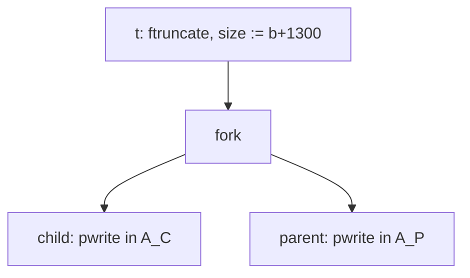

# Goal → decision → answer

**Goal:** determine whether a write at a far offset can happen before the file "has room" for it, and what `ftruncate` actually creates.

**Decision:** separate three things that "buffer" conflates: the **logical size** in the inode, the **physical blocks** on disk, and the **page cache** where written bytes sit. `ftruncate` acts only on the first. Once you split them, the question becomes whether the size update is ordered before the writes.

**Answer:** `ftruncate` sets the inode's logical size immediately and synchronously. It allocates no data and flushes nothing. It runs before `fork`, so it precedes every write from both processes. Even without it, a write past EOF is legal, so the order of the parent and child is still harmless.

## 1. The three layers

| Layer | Owner | Touched by `ftruncate` | Touched by `pwrite` |
|---|---|---|---|
| Logical size $\mathrm{size}(i)$ | inode | **yes**, set to the new length | extended if the write goes past EOF |
| Page cache (dirty pages) | inode's address space | no pages created for the extension | yes, bytes land here |
| Disk blocks | filesystem | none allocated, so the file is **sparse** | later, by writeback or `fsync` |

The extended range $[b,\,b+1300)$ is a **hole**. Reads of a hole return zeros with no blocks behind them. Real blocks appear only when data is written and later written back.

## 2. Why the order is safe: it is an event in the poset

`ftruncate` is a single event $t$ before the fork, so it sits below every write in the forced order:

$$t\prec \mathrm{fork}\prec c_k,\qquad t\prec\mathrm{fork}\prec p_k\quad\text{for all }k$$

So when the parent starts first, $\mathrm{size}(i)$ already equals $b+1300$. Its write at $b+600$ lands inside the file. The child's untouched region $[b,b+600)$ reads as zeros until the child fills it, but no write is ever out of bounds.

## 3. Without `ftruncate`, it still works

A positional write past EOF is not an error. It extends the file and leaves a hole. The size update is

$$\mathrm{size}(i)\ \mapsto\ \max\big(\mathrm{size}(i),\ \mathrm{off}+\mathrm{len}\big)$$

Here $(\mathbb{N},\max)$ is a **join-semilattice**, so `max` is commutative, associative and idempotent. Two writers extending the size in either order reach the same final size, $b+1300$. Since the content updates already commute (disjoint domains), the final file is identical in every schedule. `ftruncate` only removes the transient window, so an early observer sees a full-length file rather than a short one.

## 4. "Flush" is a different axis

- **`os.pwrite` has no user-space buffer.** Unlike `open()` file objects, `os.write` and `os.pwrite` go straight to the syscall, so there is nothing to flush from Python.
- **Visibility is immediate.** After `pwrite` returns, the bytes are in the page cache, and any process reading the file sees them.
- **Durability is separate.** Disk writeback happens later, or on `fsync(fd)`. Neither process needs it for the ordering result. It matters only for crash safety.

## 5. Caveats

- **Holes in a copy or backup** may be materialized or preserved depending on the tool, but that does not affect this program.
- **Failure at `ftruncate`** (disk quota, read-only filesystem) raises an `OSError` before the fork, so you fail before any write happens.
- **Filesystem behavior varies.** Sparse-file support and delayed block allocation differ by filesystem. Some (for example FAT) may allocate or zero-fill immediately. The logical result is the same either way.
- **Still no `waitpid`.** The parent can exit before the child finishes, so a reader may see zeros in $A_C$ until the child completes.