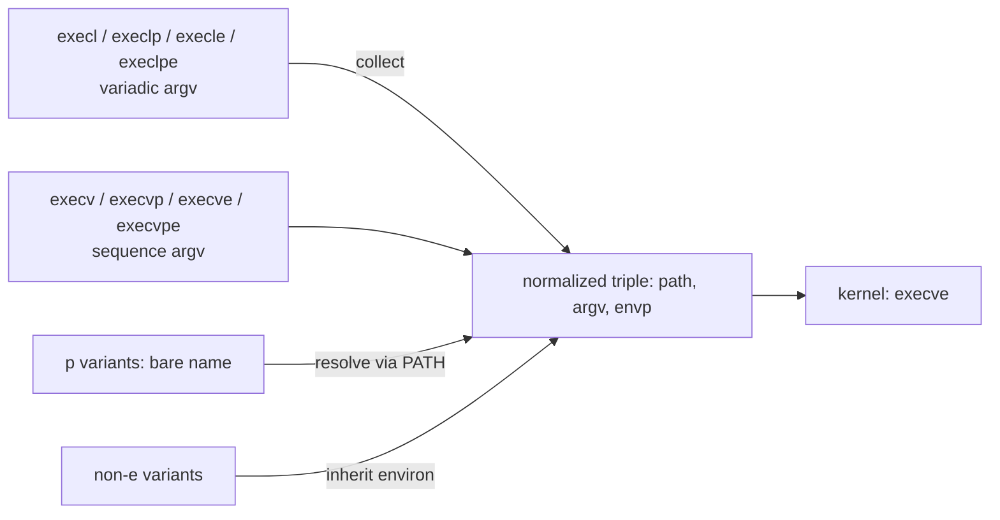

# Goal → decision → answer

**Goal:** explain why the `exec` family has so many names.

**Decision:** find the invariant first, then see what varies. There is exactly one primitive, the syscall `execve(path, argv, envp)`. Every other name is a wrapper that differs from it along independent axes.

**Answer:** mostly yes, but they are not init parameters. They are different **calling conventions** for the same three inputs. The function does one thing, replace the process image, and the names encode how you supply `path`, `argv`, and `envp`. C has no overloading or default arguments, so each combination got its own name.

## 1. The invariant: one primitive

Let $\mathrm{Path}$ be file paths, $\mathrm{Str}^*$ finite lists of strings, and $\mathrm{Env}$ the set of environments. The kernel primitive is

$$\texttt{execve}:\ \mathrm{Path}\times\mathrm{Str}^*\times\mathrm{Env}\ \to\ \bot$$

The codomain is $\bot$ because on success it never returns. The old image is discarded. It returns only on error (in Python it raises `OSError`).

## 2. The variation: three independent binary axes

Each letter in the suffix toggles one adapter.

| Axis | Choice 0 | Choice 1 | Letter |
|---|---|---|---|
| Argument shape | variadic list `execl(path, a0, a1, ...)` | one sequence `execv(path, [a0, a1])` | `l` or `v` |
| Path resolution | path used literally | bare name searched in `PATH` | `p` |
| Environment | inherit the caller's | pass an explicit mapping | `e` |

The set of variants is a product of three two-element sets:

$$V=\{l,v\}\times\{\text{literal},\,p\}\times\{\text{inherit},\,e\}\qquad |V|=2\cdot2\cdot2=8$$

## 3. Each variant factors through `execve`

Each axis corresponds to a morphism that acts on **one coordinate** of the input and leaves the others alone:

$$\mathrm{collect}:\ a_1,\dots,a_n\ \mapsto\ [a_1,\dots,a_n]\qquad \mathrm{resolve}:\ \text{name}\ \mapsto\ \text{first }d/\text{name with }d\in\texttt{PATH}\qquad \mathrm{inherit}:\ \ast\ \mapsto\ \texttt{environ}$$

Then every wrapper is `execve` precomposed with a product of adapters, for example

$$\texttt{execl}=\texttt{execve}\circ(\mathrm{id}\times\mathrm{collect}\times\mathrm{inherit})$$

$$\texttt{execvpe}=\texttt{execve}\circ(\mathrm{resolve}\times\mathrm{id}\times\mathrm{id})$$

$$\texttt{execve}=\texttt{execve}\circ(\mathrm{id}\times\mathrm{id}\times\mathrm{id})$$

Because the adapters act on different coordinates, they commute. The 8 variants form the Boolean lattice $\{0,1\}^3$, ordered by which adapters are switched on.

## 4. What is actually available

- **C (glibc):** `execl`, `execlp`, `execle`, `execv`, `execvp`, `execve` (the syscall wrapper), and `execvpe` (a GNU extension). There is no `execlpe`, so the cube has a missing vertex.
- **Python `os`:** all eight are provided (`execl`, `execle`, `execlp`, `execlpe`, `execv`, `execve`, `execvp`, `execvpe`), so the cube is complete.
- **`exec()` alone is not a function.** It names the family. Do not confuse it with Python's builtin `exec()`, which runs Python source code and is unrelated.

## 5. Gotchas that follow from the model

- **`argv[0]` is a convention, not derived.** You pass the program name yourself: `os.execv("/bin/ls", ["ls", "-l"])`. The kernel does not fill it in.
- **`p` searches the name, not the directory list you pass.** It only makes sense for bare names such as `"ls"`. A name containing `/` is used literally.
- **Nothing after a successful exec runs.** Code below it executes only on failure.
- **Tie to file descriptors:** exec keeps the PID and keeps the fd-table slots that lack close-on-exec, so the shared descriptions from earlier survive into the new image. Python opens fds non-inheritable (close-on-exec) by default since 3.4. To pass one through exec, call `os.set_inheritable(fd, True)` first.

## 6. Which to use

For the `fork` then `exec` pattern from Q1, use `execvp` when launching a command by name with a list of arguments. Use `execve` (or `execvpe`) when you need a controlled environment. In real Python code, `subprocess.run` handles the fork, exec, and wait sequence for you, so raw `os.exec*` is mainly useful for learning or for replacing the current process.