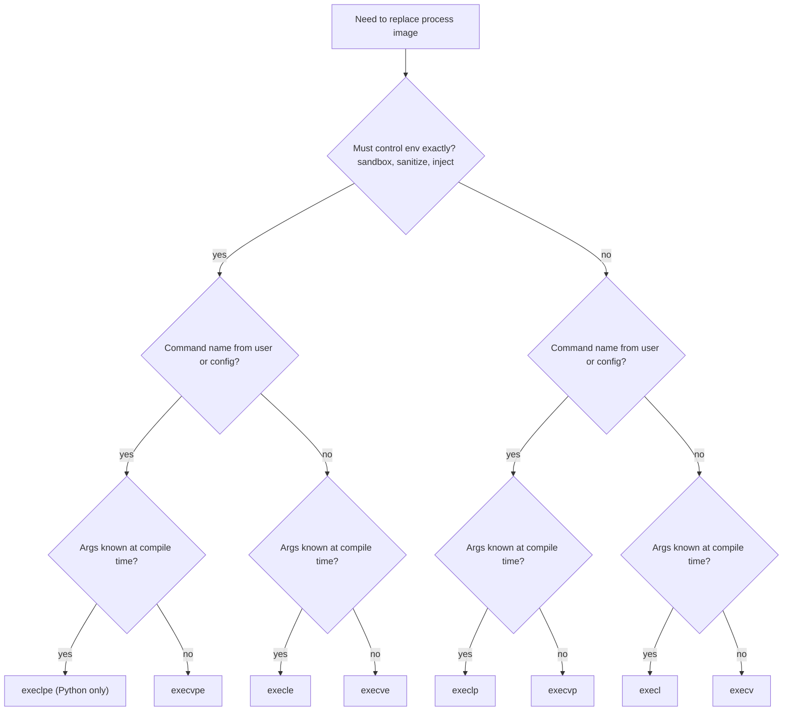

# Goal → decision → answer

**Goal:** explain why the family has 8 vertices and which use case selects each one.

**Decision:** the variants exist because each axis answers a different question about **when a value gets bound**: at the call site, at runtime by the program, or by the ambient process context. C has no overloading or defaults, so every distinct binding-time combination needed its own name. Once you see each axis as a binding-time choice, the use case for each vertex follows.

**Answer:** the 8 names come from 3 independent needs (argument arity, program lookup, environment control) that accumulated over Unix history. The kernel needs only `execve`, so the other seven exist for caller convenience and, in the `e` cases, for security and control.

## 1. Each axis is a binding-time choice

| Axis | Option | Bound when | Solves |
|---|---|---|---|
| Arity | `l` | at the call site, so the argument count is fixed in source | hardcoded commands: `execl("/bin/ls", "ls", "-l", NULL)` |
| Arity | `v` | at runtime, so the count is data | shells, launchers, anything that parses or builds an argv |
| Location | literal | at author time, since the exact path is written down | deterministic, secure launches |
| Location | `p` | at runtime, by searching `PATH` | user-typed command names, portability across systems |
| Environment | inherit | by ambient context | the default: child sees what the parent sees |
| Environment | `e` | at the call, by the caller | sandboxing, sanitizing, injecting variables |

Formally, the ambient environment is a **Reader-monad** context. Inherit is `ask`: it reads $\texttt{environ}$ from the surrounding context. The `e` variants are `runReader`: they discharge the context with an explicitly supplied value.

$$\mathrm{inherit}=\mathrm{ask}:\ \mathbf{1}\to\mathrm{Env},\qquad \mathrm{explicit}=\mathrm{run}_{\rho}:\ \mathrm{Reader}_{\mathrm{Env}}\,A\to A\ \ \text{for a chosen }\rho\in\mathrm{Env}$$

Similarly, `l` versus `v` is the choice between an $n$-ary product fixed at compile time and a list of runtime length. The bijection $\coprod_n \mathrm{Str}^n\cong\mathrm{Str}^*$ means no information differs, only *when* $n$ is known.

## 2. Why so many names instead of one function

Three causes, in order of importance:

1. **C has no overloading, no default arguments, and no keyword arguments.** A function that varies along 3 independent binary axes needs $2^3$ entry points, or it needs a config struct, which C's early idiom avoided.
2. **Variadic and array forms cannot be unified in C.** A variadic list is a compile-time argument count, and an array is a runtime count. They are different calling conventions, so `l` and `v` cannot share a function.
3. **The family grew by accretion.** Early Unix had only the plain forms. `PATH` search and explicit environments were added as needs appeared, and `execvpe` came much later as a GNU extension that newer standards adopted. The missing vertex `execlpe` is a historical accident: nobody needed it enough for it to be added.

Python keeps all 8 as thin wrappers for parity with C. Since Python has real optional arguments, it could have one function, but compatibility with the C names won.

## 3. Use case per vertex

| Code | Name | Typical use |
|---|---|---|
| `000` | `execve` | security-sensitive launch: exact path, exact argv, exact environment. This is the primitive. |
| `001` | `execv` | launch a known binary with a computed argument list, inheriting the environment |
| `010` | `execvpe` | run a command by name with a controlled environment, such as a launcher with injected variables |
| `011` | `execvp` | the shell pattern: run a user-typed command name with a parsed argument list |
| `100` | `execle` | fixed command, fixed arguments, custom environment. Rare. |
| `101` | `execl` | hardcoded one-liner: `execl("/bin/sh", "sh", "-c", cmd, NULL)` |
| `110` | `execlpe` | fixed arguments, `PATH` lookup, custom environment. Rare, absent from glibc. |
| `111` | `execlp` | quick hardcoded call by name: `execlp("ls", "ls", "-l", NULL)` |

In practice the common vertices are `execvp` (shells, launchers), `execl` and `execlp` (short hardcoded calls, examples), and `execve` (hardened code). The `e` vertices other than `execve` are uncommon.

## 4. Decision procedure



The tree asks the three binding-time questions in fixed order, so each leaf is one vertex of the cube.

## 5. The usual reason to reach for each axis

- **Choose `e` for security and reproducibility.** A setuid or privileged program must not trust an inherited `LD_PRELOAD`, `PATH`, or `IFS`, so it passes a sanitized environment. Build systems use it for hermetic builds.
- **Choose literal paths for security.** `PATH` search lets an attacker who controls a `PATH` directory substitute a binary. Literal paths remove that attack surface.
- **Choose `p` for portability and usability.** `ls` lives in `/bin` on one system and `/usr/bin` on another, and a shell must accept a bare name.
- **Choose `v` whenever arguments are built dynamically.** `l` is only convenience for fixed calls.

## 6. Where exec sits in practice

`exec` alone is rarely called directly. The standard pattern is fork, adjust, exec:

```python
pid = os.fork()
if pid == 0:
    os.dup2(out_fd, 1)          # rewire fd table slot 1 to the description behind out_fd
    os.execvp("ls", ["ls", "-l"])   # image replaced, fd table survives
else:
    os.waitpid(pid, 0)
```

The window between `fork` and `exec` is where the child edits its fd table with `dup2`. That works because exec preserves slots without close-on-exec, which is the fd-table result from earlier. This is how shell redirection and pipes are built.

## 7. Caveats

- **Prefer higher-level tools.** `subprocess` in Python and `posix_spawn` in C combine fork and exec safely. `posix_spawn` avoids the hazards of forking a multithreaded process discussed in the GIL answer.
- **Where `exec` is genuinely needed:** replacing the current process, for example a wrapper script that hands off to another program while keeping its PID, and building shells or supervisors.
- **History details are approximate.** The exact release in which each variant appeared and which standard adopted `execvpe` vary by source, so verify before citing.