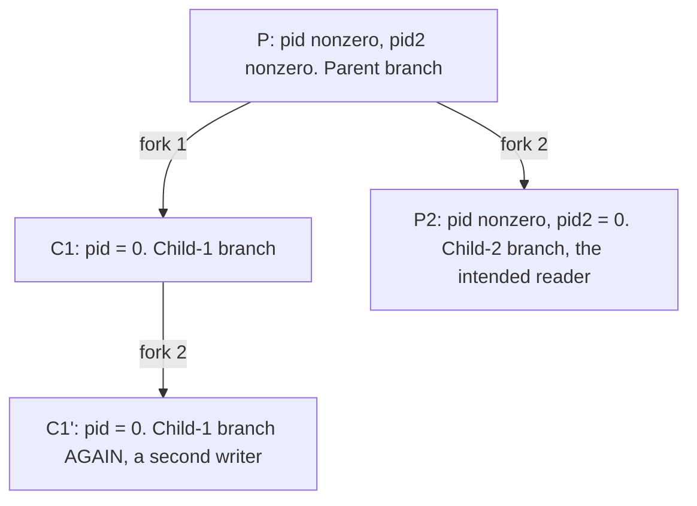
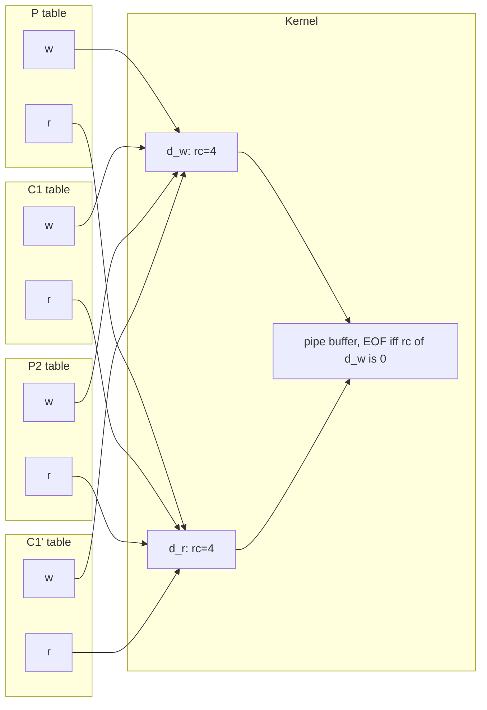
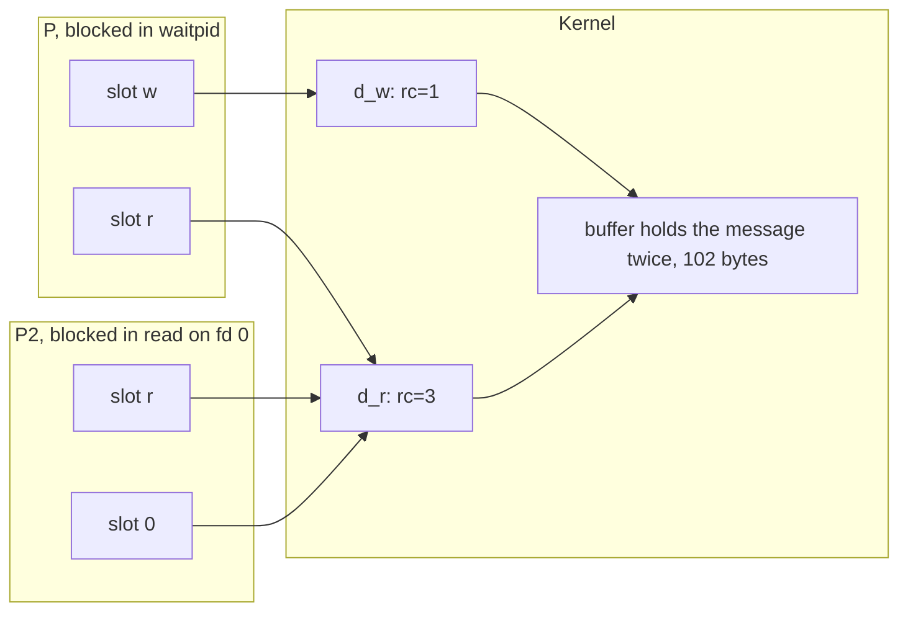
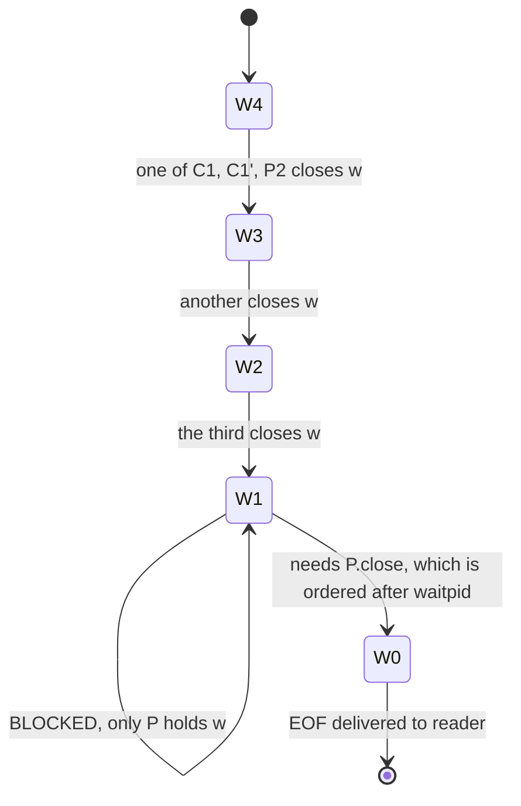
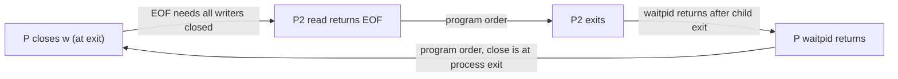
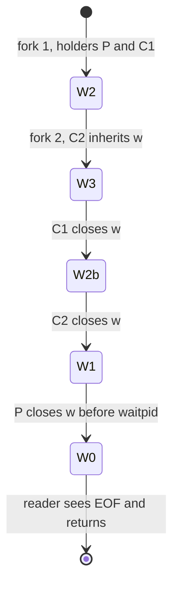
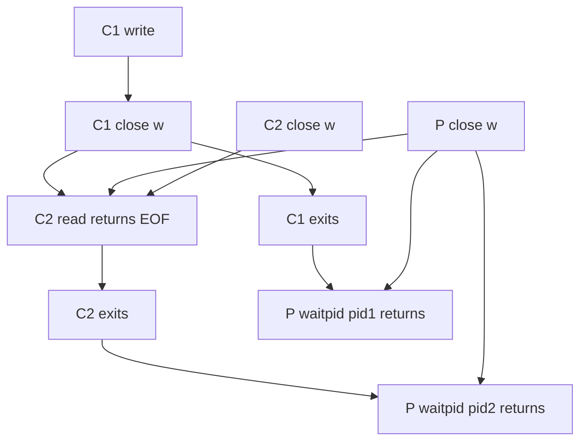
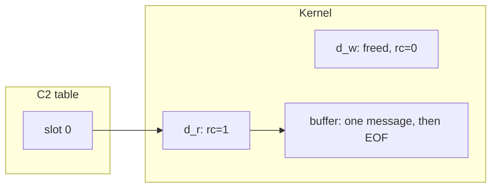

# Goal → decision → answer

**Goal:** find why the channel between the two children does not work, then show the fd and kernel state as it is and as it should be.

**Decision:** treat the pipe as a kernel object with a slot-level reference structure, as in the earlier fd model. Message passing then depends on one predicate: a reader sees EOF exactly when no slot in any process still references the write-end description. Every defect in your code is either a wrong process count or a stray slot on that predicate.

**Answer:** the program deadlocks and it creates four processes, not three. I ran it to confirm. It hangs until killed, and `Child process- 1` is printed twice. When I killed the parent, child 2 finally printed, and the message appeared twice.

## 1. Defects, by severity

1. **Deadlock: the parent never closes `w`.** Child 2's `sys.stdin.read()` returns only at EOF. EOF needs every write-end slot closed, including the parent's. The parent is blocked in `waitpid(pid2)` waiting for child 2 to exit, and it would close `w` only at its own exit.
2. **Two sequential forks create four processes, not three.** Every live process executes the second `fork`, including child 1. The grandchild also has `pid == 0`, so it takes the child-1 branch and writes the message a second time. The parent cannot `waitpid` on the grandchild, since it is not the parent's child.
3. **Child 2 does not close `r` after `dup2(r, 0)`.** This is harmless for correctness, since extra read ends never block EOF, but it leaks a slot. The idiom is dup2, then close the original.
4. **`os._exit(0)` skips stdio flushing.** The unflushed `print`s in the children are lost when stdout is a pipe or file, because it is block-buffered there. On a TTY it is line-buffered, so it looks fine. The `os.write(1, ...)` bypasses the buffer, so mixing the two also reorders output. I did not run this one.
5. **The docstrings are not docstrings.** Only the first string literal in a function is a docstring. The other two are discarded expression statements, and all three describe `dup`, `pipe`, and `dup2` rather than the function.

## 2. Why there are four processes

The `if/elif/else` classifies each process by the pair $(a,b)=([\,\texttt{pid}=0\,],\ [\,\texttt{pid2}=0\,])\in\{0,1\}^2$:

$$\beta:\{0,1\}^2\to\{\text{child1},\text{child2},\text{parent}\},\qquad \beta(1,\ast)=\text{child1},\quad \beta(0,1)=\text{child2},\quad \beta(0,0)=\text{parent}$$

The map $\beta$ is not injective, and the child-1 fiber has two elements:

$$\big|\beta^{-1}(\text{child1})\big|=|\{(1,0),(1,1)\}|=2$$

Fork applies $\Delta$ to the whole live set. $n$ unguarded sequential forks give $2^n$ processes, while guarding each child with an exit before the next fork gives $n+1$. The intended design needs a bijection between three roles and three processes.

## 3. Current state: fd tables and kernel objects

Immediately after fork 2, all four processes hold both ends. Here `r` and `w` are slots (fd numbers 3 and 4 in practice), and $d_r$, $d_w$ are the two open file descriptions of the one pipe.

After all the closes run, the system settles here:

C1 and C1' have exited, and P2 closed its `w`. What remains is one live write-end slot in the parent. My check of `/proc` while it hung matched this: the parent held both pipe fds, and child 2 held the read end on fd 0 and fd 3 with no write end.

## 4. The state machine of the write-end count

The state is $\mathrm{rc}(d_w)=|\mathrm{ev}^{-1}(d_w)|$. The three closes commute, so order does not matter, and the machine is stuck at 1:

The last edge can never fire. Formally, the required orderings form a cycle, so no partial order satisfies them:

$$\mathrm{close}_P\ \prec\ \mathrm{EOF}\ \prec\ \mathrm{exit}_{P2}\ \prec\ \mathrm{waitpid}_P\ \prec\ \mathrm{close}_P$$

Antisymmetry fails for a relation with a cycle, so the events cannot all occur.

## 5. Target state

The fix has two parts. First, place the second fork after the child-1 branch has exited (`writer` never returns), so that child 1 cannot reach it. Second, the parent closes both slots before waiting. The corrected file is below, and I ran it. It terminates and prints the message once.

The write end has three holders at most, and every one of them closes:

If C1 finishes before fork 2, the machine skips `W3` and the counts shift down by one. Any order of closes reaches $W0$, because the parent's close now precedes its wait. The ordering is a DAG:

Final steady state, with only the reader's stdin slot left:

## 6. The corrected structure, in words

- **One role per process.** Each role function closes the end it does not own, then never returns.
- **Slot ownership is complementary.** The writer owns $\{w\}$, the reader owns $\{0\}$ after rewiring, and the parent owns $\varnothing$.
- **The parent holds nothing while it waits.** That removes the cycle in section 4.

## 7. Caveats

- **Reader-first exit:** if the reader dies early, the writer gets `SIGPIPE` on its next write. Here the message is small and written once, so it is not a risk in this program.
- **`dup2` onto stdin is mainly useful before `exec`.** In this program the reader could call `os.read(r, ...)` directly. Reading through `sys.stdin` works only because nothing touched stdin before the rewire, since `sys.stdin` wraps fd 0 by number.
- **A single write of at most `PIPE_BUF` bytes is atomic.** That is why the buggy run's two messages did not interleave, but it is not the same as one reader seeing one message. Message boundaries in a pipe are not preserved.