# Goal → decision → model

**Goal:** trace the kernel objects and the process table from `os.pipe()` to the end of the corrected program, one state at a time.

**Decision:** the schedule is nondeterministic, so first fix one linearization $\sigma$ of the events and walk it. I picked the schedule that stresses the design most: the parent forks both children before either child runs, so child 2 inherits the write end and must close it. Alternative interleavings are noted at the end. Each event then acts on a small state vector, and snapshots are drawn only where the structure changes.

Assumptions: `r=3`, `w=4` (lowest free numbers), stdio slots 0, 1, 2 exist in every process and are omitted from the snapshots unless they change, and the message is 28 bytes.

## 1. Formal frame

Let $S$ be live slots, $D$ open file descriptions, and $\mathrm{ev}:S\to D$ the slot-to-description map. As before, $\mathrm{rc}(d)=|\mathrm{ev}^{-1}(d)|$. The pipe object $\pi$ has a buffer $\mathrm{buf}(\pi)\in\mathrm{Byte}^*$ and exactly two descriptions, $d_r$ and $d_w$, attached to it. The pipe-level state is the vector

$$v=\big(\mathrm{rc}(d_r),\ \mathrm{rc}(d_w),\ |\mathrm{buf}|\big)\in\mathbb{N}^3$$

Every event except `read`, `write`, and the `dup2` displacement is a **translation** of $(\mathrm{rc}_r,\mathrm{rc}_w)$ by an integer vector: a fork or `dup2` adds slots, and a `close` or exit removes them. Translations commute, so the order of closes does not affect the reachable counts. Order matters only through the observation predicates:

$$\mathrm{read\ blocks}\iff \mathrm{buf}=\varepsilon\wedge \mathrm{rc}_w>0,\qquad \mathrm{read\ returns\ 0\ (EOF)}\iff \mathrm{buf}=\varepsilon\wedge \mathrm{rc}_w=0$$

$$\mathrm{write\ raises\ SIGPIPE}\iff \mathrm{rc}_r=0$$

The kernel's own reader and writer counters count *descriptions*, not slots. Here each end has one description, so the counters stay at 1 until $\mathrm{rc}$ reaches 0. That is why the slot-level fiber size is the right quantity to track.

## 2. The trajectory in state space

```mermaid
stateDiagram-v2
  direction LR
  state "r1 w1 buf0" as s11
  state "r2 w2 buf0" as s22
  state "r3 w3 buf0" as s33
  state "r2 w3 buf0" as s23
  state "r2 w2 buf0" as s22b
  state "r1 w2 buf0" as s12
  state "r1 w2 buf28" as s12b
  state "r1 w1 buf28" as s11b
  state "r1 w0 buf28, EOF armed" as s10
  state "r2 w0 buf28" as s20
  state "r1 w0 buf28" as s10b
  state "r1 w0 buf0" as s10c
  state "r0 w0, pipe freed" as s00
  [*] --> s11: pipe
  s11 --> s22: fork 1
  s22 --> s33: fork 2
  s33 --> s23: P close r
  s23 --> s22b: P close w
  s22b --> s12: C1 close r
  s12 --> s12b: C1 write 28 bytes
  s12b --> s11b: C1 close w
  s11b --> s10: C2 close w
  s10 --> s20: C2 dup2 r onto 0
  s20 --> s10b: C2 close r
  s10b --> s10c: C2 read returns 28 bytes
  s10c --> s10c: C2 read returns 0, EOF
  s10c --> s00: C2 exit
  s00 --> [*]
```

Two invariants are visible in the path. The count $\mathrm{rc}_w$ reaches 0 only after **all three** holders have closed (P, C1, C2). The end state is $(0,0)$: every slot created by `pipe`, `fork`, or `dup2` is destroyed by a `close` or an exit, so nothing leaks. The buggy program stopped at $\mathrm{rc}_w\ge 1$.

## 3. The full state table

Process-table column codes: R running, Z zombie (exited, status held until the parent reaps it), – not yet created, X reaped and removed.

| # | Event | $\mathrm{rc}_r$ | $\mathrm{rc}_w$ | buf | P | C1 | C2 |
|---|---|---|---|---|---|---|---|
| 0 | start | | | | R | – | – |
| 1 | `os.pipe()` | 1 | 1 | 0 | R | – | – |
| 2 | fork 1 | 2 | 2 | 0 | R | R | – |
| 3 | fork 2 | 3 | 3 | 0 | R | R | R |
| 4 | P `close(r)` | 2 | 3 | 0 | R | R | R |
| 5 | P `close(w)` | 2 | 2 | 0 | R | R | R |
| 6 | C1 `close(r)` | 1 | 2 | 0 | R | R | R |
| 7 | C1 `write(w, MSG)` | 1 | 2 | 28 | R | R | R |
| 8 | C1 `close(w)` | 1 | 1 | 28 | R | R | R |
| 9 | C1 `_exit(0)` | 1 | 1 | 28 | R | Z | R |
| 10 | C2 `close(w)` | 1 | **0** | 28 | R | Z | R |
| 11 | C2 `dup2(r, 0)` | 2 | 0 | 28 | R | Z | R |
| 12 | C2 `close(r)` | 1 | 0 | 28 | R | Z | R |
| 13a | C2 `read` returns 28 bytes | 1 | 0 | 0 | R | Z | R |
| 13b | C2 `read` returns 0 | 1 | 0 | 0 | R | Z | R |
| 14 | C2 `write(1, ...)` | 1 | 0 | 0 | R | Z | R |
| 15 | C2 `_exit(0)` | 0 | 0 | freed | R | Z | Z |
| 16 | P `waitpid(pid1)` | | | | R | X | Z |
| 17 | P `waitpid(pid2)` | | | | R | X | X |
| 18 | P prints, exits | | | | Z | X | X |

## 4. Snapshots where the structure changes

### After `os.pipe()` (step 1)

One process, two new descriptions tied to one pipe object.

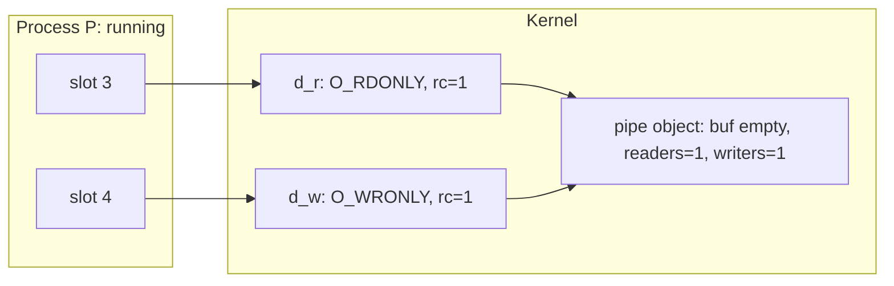

### After both forks (step 3)

The tables are copied and no descriptions are created. Every description's count grows by one per copied slot, so each is now shared three ways. C2 has the write end even though it will never use it.

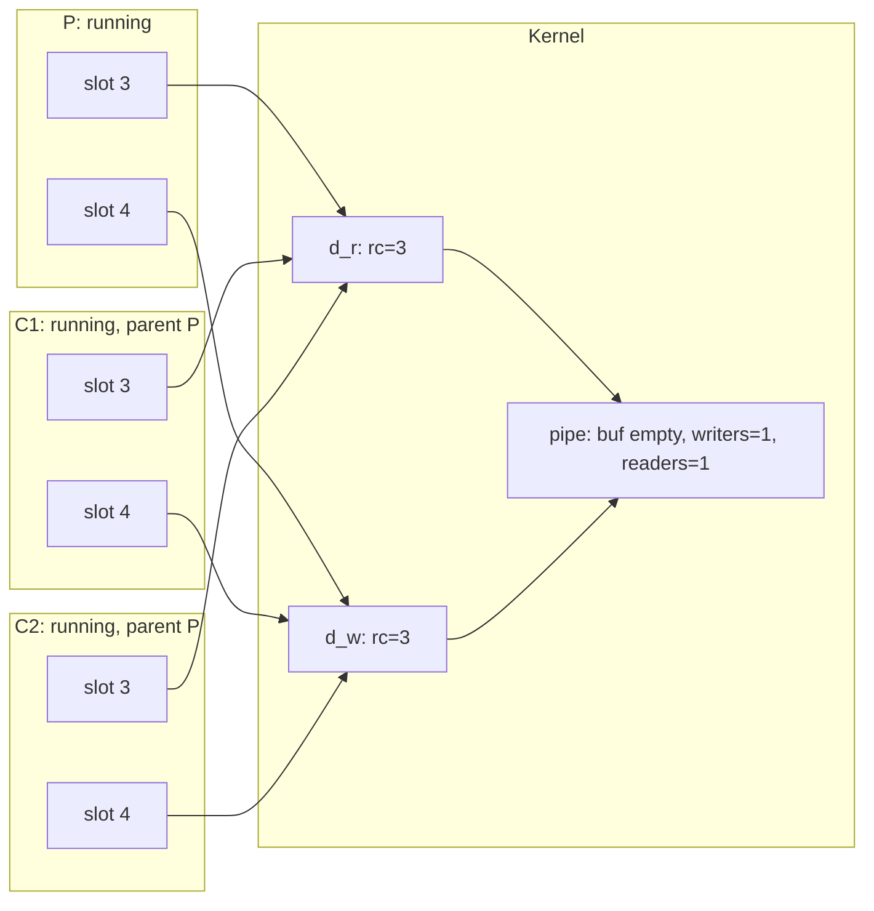

### After the parent closes both ends (step 5)

The parent now holds no pipe slots, which is what makes EOF reachable later.

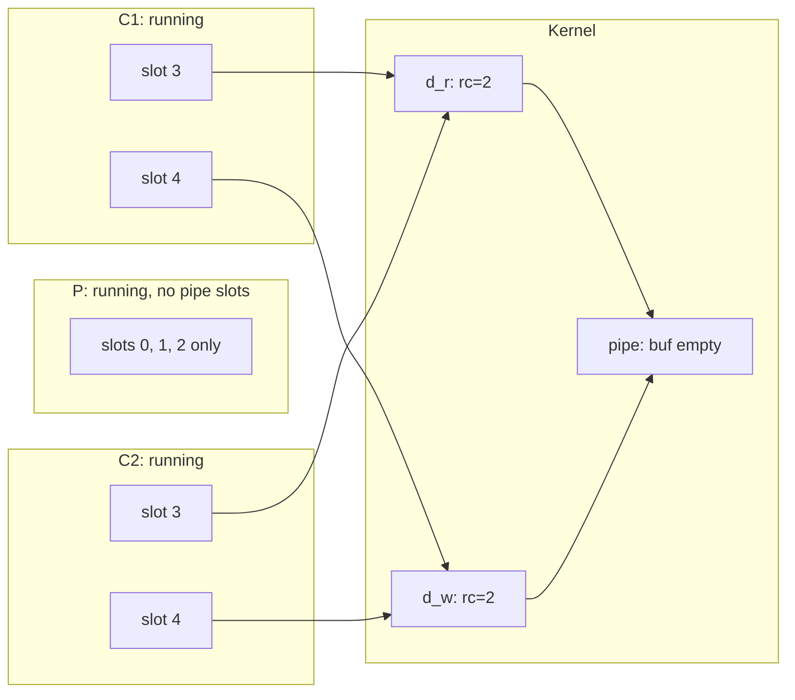

### After child 1 has finished (step 9)

C1 closed its read end, wrote 28 bytes, closed its write end, and exited. The buffer holds the message. C1 keeps a process-table entry as a zombie, with no slots, so its exit status is available until the parent reaps it. Only C2 references the pipe.

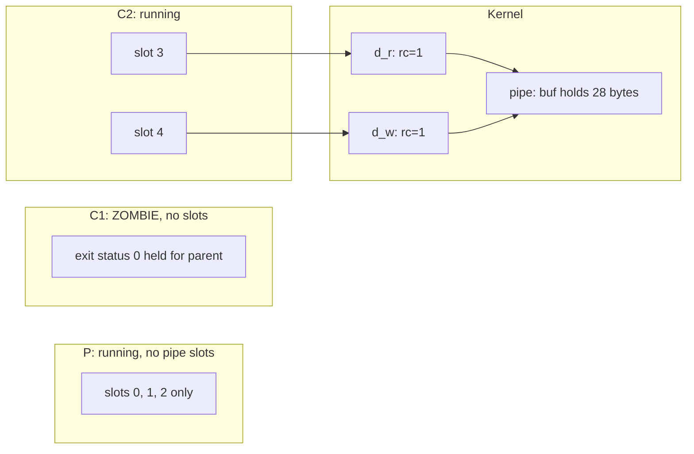

### After child 2 closes `w` (step 10): the EOF moment

The last write-end slot is gone, so $\mathrm{rc}(d_w)=0$ and the description is freed. The pipe's writer count drops to 0. The data is still buffered, so the reader will see the 28 bytes first and EOF only after that.

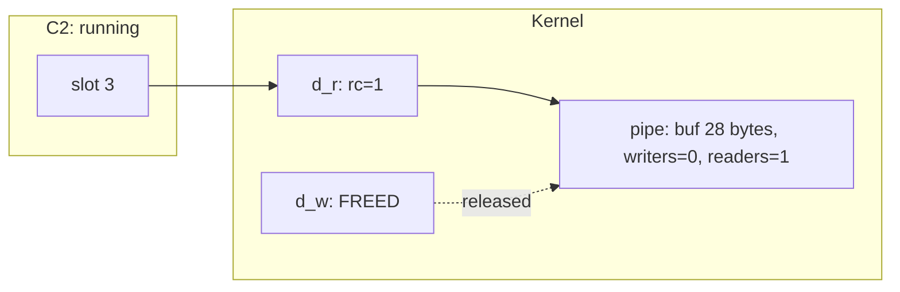

### After `dup2(r, 0)` then `close(r)` (step 12)

The `dup2` first closes whatever slot 0 held. That decrements the terminal's stdin description, which stays alive through the shell's other slots. Then slot 0 is pointed at $d_r$, briefly giving two slots (step 11, $\mathrm{rc}_r=2$). `close(r)` removes the redundant one. Now `sys.stdin`, which wraps fd 0, reads the pipe.

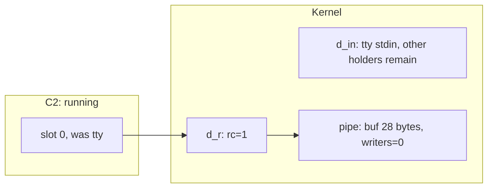

### After the reads (step 13)

`sys.stdin.read()` loops on the `read` syscall until it returns 0. The first call drains the 28 bytes. The second finds $\mathrm{buf}=\varepsilon$ and $\mathrm{rc}_w=0$, so it returns 0 and Python's `read()` completes.

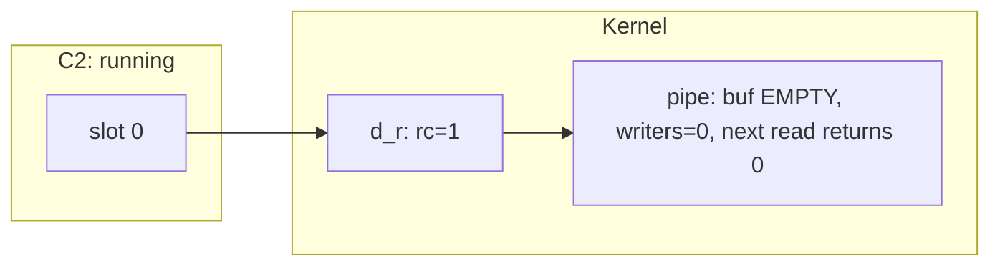

### After child 2 exits (step 15)

C2's exit closes slot 0, so $\mathrm{rc}(d_r)=0$. Both ends are gone, so the pipe object is freed. Only process-table entries remain.

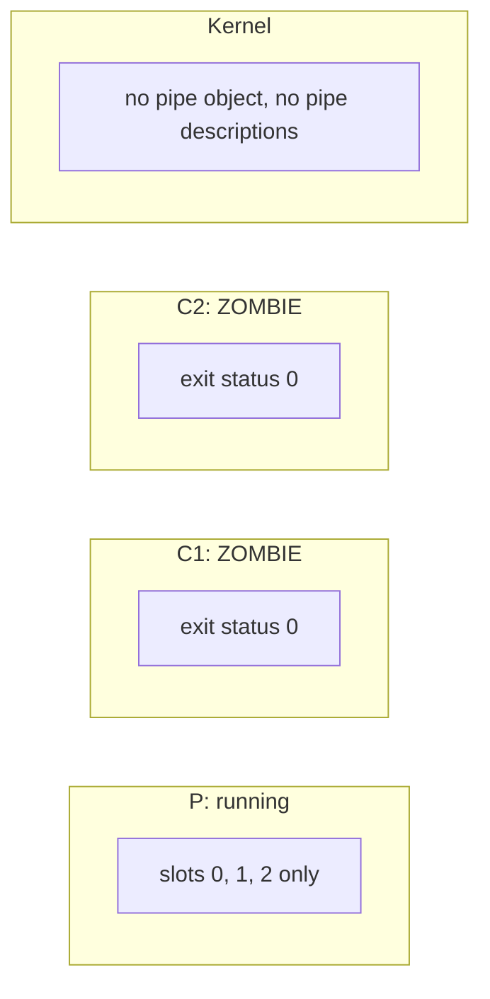

### After both reaps and the parent's exit (steps 16 to 18)

`waitpid` removes each zombie entry and returns its status. When P exits it becomes a zombie itself, and its parent (the shell) reaps it. The table has no children left.

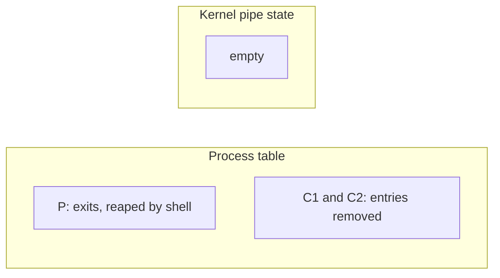

## 5. Process-table lifecycle, generalized

The walk used only R and Z, because in this schedule the children finish before the parent waits. A different interleaving adds the sleeping state.

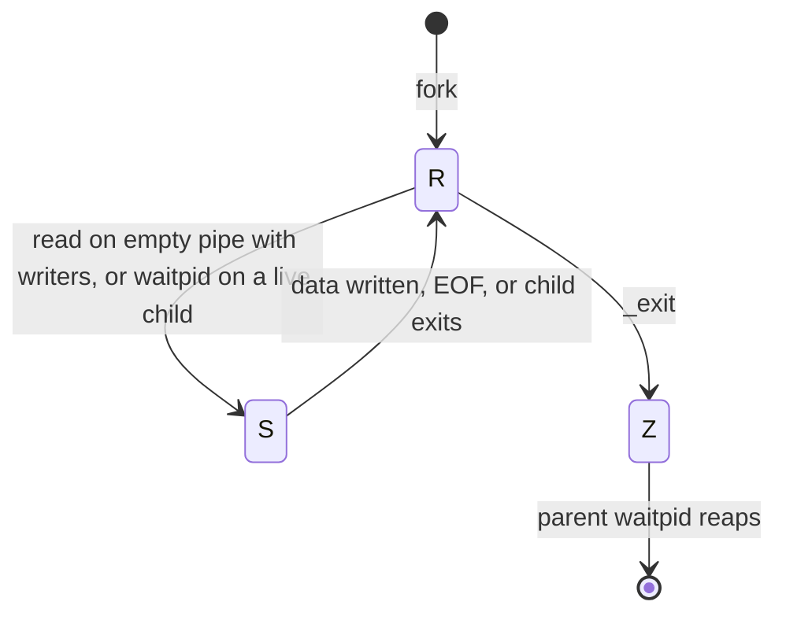

## 6. What changes under other schedules

- **Child 1 finishes before fork 2.** The state $(3,3)$ never occurs. Fork 2 copies only P's slots, giving $(2,2)\to$ P's closes $\to(1,1)$ and the same end state.
- **Child 2 reaches `read` before child 1 writes.** With $\mathrm{buf}=\varepsilon$ and $\mathrm{rc}_w>0$, the read blocks and C2 moves to S. The write wakes it. The ordering constraint is unchanged: the read can return EOF only after all three closes.
- **Parent reaches `waitpid` before a child exits.** P sleeps in S, then wakes when the child becomes a zombie.
- **Any order of the close events** gives the same counts, because they are commuting translations.

## 7. Caveats

- **The counts are a model of slots, not directly readable kernel fields.** Linux tracks a per-description reference count that also includes transient references, for example during an in-flight `read`. `/proc/<pid>/fd` lets you see which slots exist, but not that count.
- **Stdio slots are omitted** except at the `dup2` step. In a real run they are additional slots pointing at the shell's terminal descriptions.
- **The 28-byte message fits in the default 64 KiB pipe buffer**, so the writer never blocks. A message larger than the buffer would put C1 to sleep until the reader drained it, and the corrected structure would still work, since the reader runs concurrently.