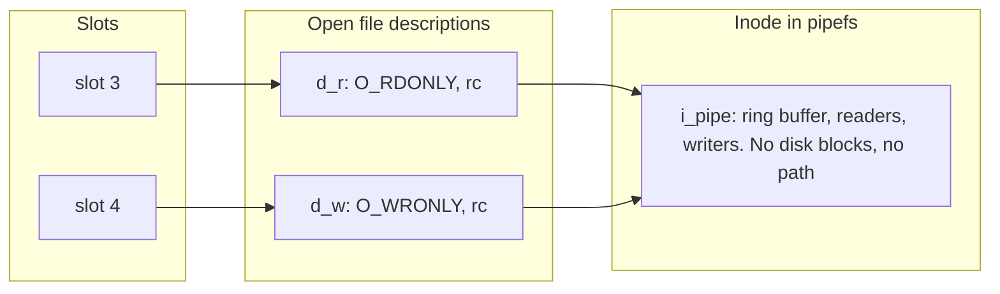

# Goal → decision → answer

**Goal:** settle whether `os.pipe()` creates an inode, and place it in the slot, description, inode chain from the fd discussion.

**Decision:** in that chain the inode is the object that owns the data. So the question is whether a pipe's buffer belongs to an inode or to some separate kernel structure.

**Answer:** yes, on Linux. `pipe()` allocates one inode in `pipefs`, an in-kernel pseudo-filesystem, and attaches a `pipe_inode_info` to it (the ring buffer plus the reader and writer counters). It then creates two open file descriptions on that inode, one read-only and one write-only, and returns a slot for each. I called this the "pipe object" in the last walkthrough. It is the inode, so that label was loose.

## 1. Where it sits in the chain

Both descriptions map to the same inode:

$$\mathrm{ino}(d_r)=\mathrm{ino}(d_w)=i_\pi,\qquad d_r\neq d_w$$

That puts the read slot and the write slot on different levels of the partition chain:

$$\Delta_S\ \subseteq\ R_D\ \subseteq\ R_I$$

The two slots are $R_I$-related, since they share an inode, but not $R_D$-related, since they are different descriptions. That is the same configuration as opening one regular file twice. The difference is the access mode stored in each description, which is fixed at creation: $d_r$ is `O_RDONLY` and $d_w$ is `O_WRONLY`.



## 2. How it differs from a regular file's inode

| Property | Regular file inode | Pipe inode |
|---|---|---|
| Filesystem | on-disk (ext4, etc.) | `pipefs`, in memory only |
| Reachable by path | yes | no. It has no directory entry in any mounted tree |
| Data lives in | page cache, backed by disk blocks | a ring of kernel buffer pages, no backing store |
| Lifetime | persists after the last close | freed when the last description closes |
| `lseek` | meaningful (offset field) | fails with `ESPIPE`, because the offset is unused |
| Type bits | `S_IFREG` | `S_IFIFO` |

The last row is why `os.fstat` on a pipe fd reports a FIFO. A named pipe made with `mkfifo` uses the same pipe mechanism, but its inode lives in a real filesystem, so it has a path. Every `open` of that path creates new descriptions on the same inode.

## 3. You can observe it

```python
import os, stat
r, w = os.pipe()
sr, sw = os.fstat(r), os.fstat(w)
print(stat.S_ISFIFO(sr.st_mode), sr.st_ino == sw.st_ino)  # True True
print(os.readlink(f"/proc/self/fd/{r}"))                  # pipe:[<inode number>]
```

The `pipe:[798]` entries in the `/proc` listing I took earlier are this: the number in brackets is the inode number, and both the read and write slots showed the same one.

## 4. Consequence for the earlier model

The state vector and the diagrams do not change. Only the label does: the "pipe object" node is the inode, and its reader and writer counters count descriptions. The EOF rule stays the same, because $d_w$ is freed exactly when its last slot closes.

## 5. Caveats

- **This is Linux's design.** POSIX specifies pipe behavior, not the inode structure. Other Unixes have implemented pipes differently, for example on top of socket pairs in some BSDs.
- **The internal names (`pipefs`, `i_pipe`, `pipe_inode_info`) are kernel implementation details** and can change across versions. The observable facts are the ones in section 3.
- **The inode number is not stable identity across boots or reuse.** After the pipe is freed, the number can be reassigned.