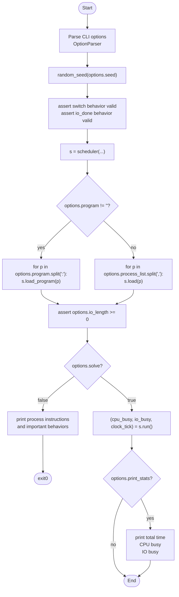

Here are two Mermaid diagrams: first the **outer script layer**, then the **`scheduler.run()` layer**.

### 1. Outer layer

### 2. `scheduler.run()` layer

```mermaid
flowchart TD
    RunStart([scheduler.run]) --> EmptyCheck{"len(proc_info) == 0?"}
    EmptyCheck -- yes --> ReturnNone([return])
    EmptyCheck -- no --> InitIO["io_finish_times = dict per pid"]
    InitIO --> FirstProc["curr_proc = 0<br/>move_to_running(READY)"]
    FirstProc --> PrintHeader["print table header:<br/>Time, PID:x..., CPU, IOs"]
    PrintHeader --> InitStats["io_busy = 0<br/>cpu_busy = 0"]
    InitStats --> WhileActive{"get_num_active() > 0?"}
    WhileActive -- no --> ReturnStats["return (cpu_busy, io_busy, clock_tick)"]
    WhileActive -- yes --> Tick["clock_tick += 1"]

    Tick --> IOLoop["for each pid:<br/>if clock_tick in io_finish_times[pid]"]
    IOLoop --> IODoneCheck{"io_done?"}

    IODoneCheck -- yes --> MoveReady["move_to_ready(WAIT, pid)"]
    MoveReady --> IORun{"io_done_behavior"}
    IORun -- IO_RUN_IMMEDIATE --> Imm["if curr_proc != pid and curr RUNNING:<br/>move_to_ready(RUNNING)<br/>next_proc(pid)"]
    IORun -- IO_RUN_LATER --> Later["if SWITCH_ON_END and runnable > 1:<br/>next_proc(pid)<br/>if runnable == 1: next_proc(pid)"]

    Imm --> CheckDoneA["check_if_done()"]
    Later --> CheckDoneA
    IODoneCheck -- no --> CheckDoneA

    CheckDoneA --> CanExec{"curr_proc RUNNING<br/>and code length > 0?"}
    CanExec -- yes --> Exec["instruction_to_execute = pop(0)<br/>cpu_busy += 1"]
    CanExec -- no --> NoExec["instruction_to_execute = ''"]

    Exec --> PrintRow
    NoExec --> PrintRow

    PrintRow["print clock_tick (star if io_done)<br/>per-PID state or RUN:inst<br/>CPU column: 1 or blank"] --> IOOutstanding{"get_ios_in_flight(clock_tick) > 0?"}

    IOOutstanding -- yes --> IOBusy["print num_outstanding<br/>io_busy += 1"]
    IOOutstanding -- no --> IOBlank["print blank IO column"]

    IOBusy --> IOInstr
    IOBlank --> IOInstr

    IOInstr{"instruction_to_execute == DO_IO?"}
    IOInstr -- yes --> StartIO["move_to_wait(RUNNING)<br/>append clock_tick + io_length + 1<br/>to io_finish_times[curr_proc]"]
    StartIO --> SwitchCheck{"process_switch_behavior == SWITCH_ON_IO?"}
    SwitchCheck -- yes --> Next["next_proc()"]
    SwitchCheck -- no --> CheckDoneB["check_if_done()"]
    Next --> CheckDoneB

    IOInstr -- no --> CheckDoneB
    CheckDoneB --> WhileActive
```

The second diagram treats helper methods like `next_proc()` and `check_if_done()` as calls; internally, `check_if_done()` marks the current process `DONE` and advances when its instruction list is empty.