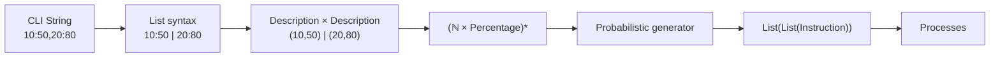

Absolutely. The `-l` flag is particularly nice because it is essentially a **small algebraic language embedded inside a CLI string**.

The source defines `-l/--processlist` as a comma-separated list of process descriptions, where each description has the form:

$$
X:Y
$$

with \(X\) = number of instructions and \(Y\) = percentage chance that each instruction is CPU. 

Let's deconstruct that from characters all the way to the semantic object.

---

# 1. Concrete syntax

A CLI invocation might be:

```text
-l 10:50,20:80,5:30
```

There are **three levels of syntax** here:

$$
\boxed{
\texttt{10:50,20:80,5:30}
}
$$

First split on `,`:

$$
[\,\texttt{10:50},\texttt{20:80},\texttt{5:30}\,]
$$

Then split each element on `:`:

$$
\begin{aligned}
\texttt{10:50} &\mapsto (10,50)\\
\texttt{20:80} &\mapsto (20,80)\\
\texttt{5:30} &\mapsto (5,30)
\end{aligned}
$$

So the grammar is approximately:

$$
\boxed{
ProcessList ::= Description^*
}
$$

where

$$
\boxed{
Description ::= Number \;:\; Percentage
}
$$

and the `,` is the list separator.

---

# 2. The fundamental algebra

Define:

$$
N = \mathbb N
$$

for the instruction count, and

$$
P = \{0,1,\ldots,100\}
$$

for the CPU percentage.

Then a single process description is simply:

$$
\boxed{
D = N \times P
}
$$

So:

$$
10:50
$$

is represented semantically as:

$$
(10,50)
$$

and

$$
20:80
$$

as:

$$
(20,80)
$$

The `:` itself has **no semantic meaning**.

It is a **serialization operator**:

$$
serialize(n,p) = \texttt{"}n\texttt{:}p\texttt{"}
$$

and parsing reverses it:

$$
parse(\texttt{"}n\texttt{:}p\texttt{"})=(n,p)
$$

---

# 3. Then `,` gives us a list algebra

The entire `-l` argument is not one description.

It is a sequence:

$$
D^*
$$

where \(D^*\) is the **free monoid over descriptions**.

Therefore:

$$
\boxed{
ProcessList = (N\times P)^*
}
$$

For:

```text
-l 10:50,20:80,5:30
```

the semantic value is:

$$
[(10,50),(20,80),(5,30)]
$$

or mathematically:

$$
\boxed{
((10,50),(20,80),(5,30))
\in
(N\times P)^*
}
$$

---

# 4. The ADT version

In algebraic-data-type notation:

```text
ProcessDescription
    = Count × CpuChance

ProcessList
    = List(ProcessDescription)
```

or:

$$
\boxed{
Description = Count\times CpuChance
}
$$

$$
\boxed{
ProcessList = List(Description)
}
$$

Expanding:

$$
\boxed{
ProcessList = List(\mathbb N\times\{0,\ldots,100\})
}
$$

This is the core algebra of `-l`.

---

# 5. But then something interesting happens

The pair

$$
(n,p)
$$

is **not itself a program**.

It is a **program generator specification**.

For example:

$$
(10,50)
$$

means:

> Generate 10 instructions, with each instruction independently having probability \(0.5\) of being CPU.

So there is another function:

$$
G : N\times P \rightarrow Instruction^*
$$

where

$$
Instruction = CPU + IO + IODone
$$

---

# 6. The generator algebra

For a description:

$$
(n,p)
$$

we generate:

$$
I_1,I_2,\ldots,I_n
$$

with:

$$
I_k =
\begin{cases}
CPU & \text{with probability }p/100\\
IO\cdot IODone & \text{with probability }1-p/100
\end{cases}
$$

So the instruction choice is itself a sum type:

$$
\boxed{
InstructionChoice
=
CPU + (IO\times IODone)
}
$$

The implementation represents an I/O instruction by appending two semantic instructions:

```text
IO
IODone
```


Thus:

$$
G(n,p)
\in
Instruction^*
$$

with exactly \(n\) **generated actions** before considering the `IO → IO_DONE` expansion.

---

# 7. One description is therefore a probabilistic algebra

We can write:

$$
G_{n,p}
:
\{CPU,\;IO\}^{n}
\rightarrow
Instruction^*
$$

where each position has distribution

$$
X_i\sim Bernoulli(p/100)
$$

and

$$
X_i=
\begin{cases}
CPU & p/100\\
IO & 1-p/100.
\end{cases}
$$

Then we apply:

$$
IO\mapsto IO\cdot IODone
$$

So:

$$
CPU\mapsto [CPU]
$$

$$
IO\mapsto [IO,IODone]
$$

and concatenate.

---

# 8. Example

Take:

$$
10:50
$$

This means:

$$
n=10,\qquad p=50
$$

Therefore:

$$
X_1,\ldots,X_{10}
\overset{iid}{\sim}
Bernoulli(0.5)
$$

Suppose RNG produces:

$$
[CPU,CPU,IO,CPU,IO,\ldots]
$$

The semantic expansion becomes:

$$
[
CPU,
CPU,
IO,
IODone,
CPU,
IO,
IODone,
\ldots
]
$$

So the original `10:50` is **not the instruction sequence**.

It is a **parameter to a stochastic generator**.

---

# 9. The full `-l` pipeline

This is the cleanest way to see the algebra:

$$
\boxed{
\texttt{"10:50,20:80"}
}
$$

↓

**serialization parsing**

$$
\boxed{
[(10,50),(20,80)]
}
$$

↓

**type**

$$
\boxed{
(N\times P)^*
}
$$

↓

**random generation**

$$
\boxed{
[G(10,50),G(20,80)]
}
$$

↓

**programs**

$$
\boxed{
Instruction^*\times Instruction^*
}
$$

↓

**processes**

$$
\boxed{
Process^*
}
$$

So:

$$
\boxed{
String
\xrightarrow{parse}
(N\times P)^*
\xrightarrow{G^*}
(Instruction^*)^*
}
$$

---

# 10. And there's a beautiful algebraic simplification

Because lists satisfy:

$$
(A^*)^*\cong A^*
$$

up to flattening, we can regard the entire generated process list as eventually producing:

$$
Instruction^*
$$

**per process**.

More precisely:

$$
G^* :
(N\times P)^*
\rightarrow
(Instruction^*)^*
$$

where each element corresponds to one process.

Thus:

$$
\boxed{
-l
:
String
\rightarrow
List(Count\times Percentage)
\rightarrow
List(List(Instruction))
}
$$

That last type is extremely revealing:

$$
\boxed{
List(List(Instruction))
}
$$

means:

> a list of processes, where each process is a list of instructions.

---

## 11. The whole algebra in one picture



The key distinction I'd keep in your head is:

$$
\boxed{
\underbrace{(n,p)}_{\text{data}}
\quad\xrightarrow{\text{random generator}}\quad
\underbrace{I^*}_{\text{program}}
}
$$

So `10:50` is **not an instruction algebra**. It is an element of the **parameter algebra**

$$
\boxed{\mathbb N\times\{0,\ldots,100\}}
$$

and `,` lifts that into the free monoid

$$
\boxed{
(\mathbb N\times\{0,\ldots,100\})^*
}
$$

which is then interpreted by the scheduler as a **probabilistic program generator**.
