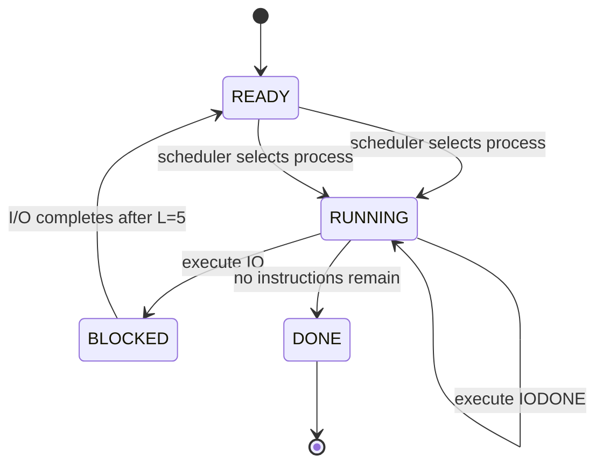

Yes. In **this simulator**, the default I/O duration is **5 clock ticks**, because `-L/--iolength` defaults to `5`. 

But there is an important subtlety: an I/O instruction itself consumes **one CPU tick to issue**, then the process becomes `BLOCKED`, and the simulator schedules the I/O completion at

$$
t_{\text{finish}} = t_{\text{issue}} + L + 1
$$

where \(L=5\). 

So let's trace the exact lifecycle.

## 1. Start with `-l 1:0`

Because `Y=0`, the single generated instruction is an I/O instruction. The loader appends `DO_IO`, followed by `DO_IO_DONE`. 

So semantically:

$$
1:0
\longrightarrow
[IO,IODONE]
$$

The `IODONE` is important: **the simulator models completion handling as another CPU action.**

---

# 2. Full lifecycle

Assume defaults:

```text
-L 5
-S SWITCH_ON_IO
-I IO_RUN_LATER
```

The scheduler starts with the process in `READY`, then makes it `RUNNING`. 

### Tick 1 — issue I/O

The current process executes:

$$
IO
$$

The code then does:

```python
self.move_to_wait(STATE_RUNNING)
self.io_finish_times[self.curr_proc].append(
    clock_tick + self.io_length + 1
)
```


At \(t=1\):

$$
RUNNING
\xrightarrow{IO}
BLOCKED
$$

and:

$$
t_{\text{finish}}=1+5+1=7
$$

So the I/O device is considered to have an outstanding I/O during ticks 1–6, with completion detected at tick 7.

---

### Ticks 2–6 — blocked

The process is:

$$
BLOCKED
$$

while the I/O is in flight.

The scheduler checks every tick whether:

$$
clock\_tick\in io\_finish\_times[pid]
$$


There is no match at \(2,3,4,5,6\).

---

### Tick 7 — I/O completes

At:

$$
t=7
$$

the scheduler finds the completion time:

```python
if clock_tick in self.io_finish_times[pid]:
```

and transitions:

$$
BLOCKED\rightarrow READY
$$


With the default:

```text
-I IO_RUN_LATER
```

the process is **not necessarily immediately scheduled**; the code follows the `IO_RUN_LATER` branch. 

Then eventually the process gets CPU time again.

---

### Next CPU tick — `IODONE`

The next instruction in its program is:

$$
IODONE
$$

The loader explicitly inserted this instruction after every `IO`. 

So conceptually:

$$
IO
\quad\underbrace{\longrightarrow}_{\text{5 ticks of I/O}}
\quad
IODONE
$$

The simulator describes this as one CPU action used to handle the I/O completion; the upstream README explicitly notes that this is a simplification of a real I/O model. ([GitHub][1])

---

# 3. Mermaid lifecycle



The key thing is that **`IO` causes the state transition**, whereas `IODONE` is an instruction executed after the asynchronous I/O has completed.

---

# 4. Timeline

For a simple:

```text
-l 1:0 -L 5
```

you can think of the timeline as:

```mermaid
gantt
    title I/O lifecycle in the simulator
    dateFormat X
    axisFormat %s

    section Process
    Issue IO              :0, 1
    BLOCKED / IO in flight :1, 7
    IODONE CPU action       :7, 8
```



So there are three conceptually different intervals:

$$
\boxed{
\underbrace{1\text{ tick}}_{\text{issue IO}}
+
\underbrace{5\text{ ticks}}_{\text{I/O latency}}
+
\underbrace{1\text{ tick}}_{\text{IODONE}}
}
$$

giving roughly:

$$
7\text{ ticks}
$$

for one complete `IO → IODONE` cycle **when there is no additional scheduling delay**.

---

## 5. Why the `+1` is interesting

This line is the heart of the simulator:

```python
clock_tick + self.io_length + 1
```


If the I/O is issued at:

$$
t=1
$$

and:

$$
L=5
$$

then:

$$
finish=1+5+1=7
$$

The extra `+1` is effectively accounting for the simulator's discrete-tick convention.

So don't interpret:

$$
IO\ length=5
$$

as:

> "the entire `IO` instruction takes 5 ticks."

Instead:

$$
\boxed{
\text{IO instruction}
=
\text{CPU action that initiates an asynchronous operation}
}
$$

and separately:

$$
\boxed{
\text{I/O latency}=5\text{ ticks}
}
$$

and then:

$$
\boxed{
IODONE
=
\text{CPU action handling completion}
}
$$

That's a much more accurate model of what this particular simulator is trying to teach. The simulator's own README says the process consists of CPU instructions or instructions that issue I/O and wait for completion, and explicitly calls the extra completion action a simplification. ([GitHub][1])

### One subtle correction to keep in mind

The **5 ticks are not necessarily 5 ticks of wall-clock time from `IO` to the next CPU execution**. Scheduling policy can insert additional delay after the I/O becomes ready. That's precisely why `-I IO_RUN_LATER` vs `-I IO_RUN_IMMEDIATE` exists. The code handles completion first, then decides whether the completed process gets CPU immediately or later. 

So the clean abstraction is:

$$
\boxed{
RUNNING
\xrightarrow{issue(IO)}
BLOCKED
\xrightarrow[\text{5-tick latency}]{I/O\ completion}
READY
\xrightarrow{scheduler}
RUNNING
\xrightarrow{IODONE}
\text{next instruction}
}
$$

That is the actual **process + I/O state machine** hiding underneath the CLI.

[1]: https://github.com/remzi-arpacidusseau/ostep-homework/blob/master/cpu-intro/README.md?utm_source=chatgpt.com "ostep-homework/cpu-intro/README.md at master · remzi-arpacidusseau/ostep-homework · GitHub"
