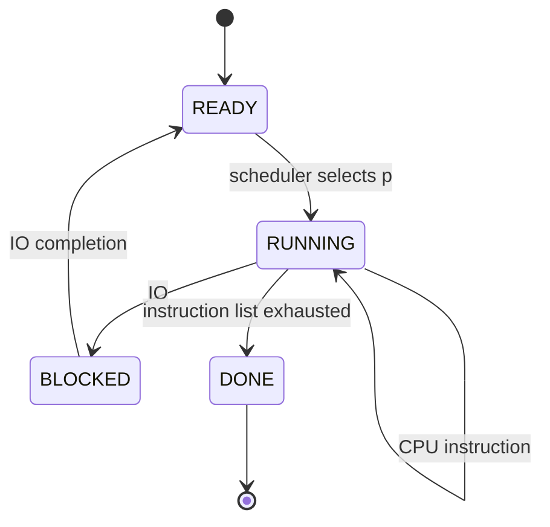

Yes. In `run()`, there are **two different notions of “state”** worth separating:

1. **The process state ADT** — what state each process is in.
2. **The runtime/system state** — everything `run()` stores and checks to simulate execution.

## 1. The process-state ADT

The explicit process states are:

$$
\boxed{
ProcessState =
Running
+ Ready
+ Blocked
+ Done
}
$$

This is a **sum type / tagged union**: a process is in exactly one of these states.

In the code these are:

```python
STATE_RUNNING
STATE_READY
STATE_WAIT      # value is 'BLOCKED'
STATE_DONE
```

So algebraically:

$$
\mathcal S
=
\{Running, Ready, Blocked, Done\}
$$

with transitions such as:

$$
Ready \rightarrow Running
$$

$$
Running \rightarrow Blocked
$$

$$
Blocked \rightarrow Ready
$$

$$
Running \rightarrow Done
$$

The important point is that **`run()` doesn't just check these states; it mutates them through the transition helpers**.

---

# 2. The actual runtime state ADT

The interesting part is that `run()` maintains more than just a `ProcessState`.

Conceptually:

$$
\boxed{
RuntimeState =
Clock
\times
CurrentProcess
\times
ProcessTable
\times
IOFinishTable
\times
CPUStats
}
$$

More explicitly:

$$
RuntimeState =
\mathbb N
\times
PID
\times
(PID \to Process)
\times
(PID \to List(\mathbb N))
\times
Stats
$$

Let's break this down.

---

## A. `clock_tick`

```python
clock_tick = 0
```

This is the global simulation time.

ADT:

$$
Clock = \mathbb N
$$

and every loop iteration performs:

$$
clock' = clock + 1
$$

So:

$$
clock_t = t
$$

after \(t\) iterations.

---

## B. `curr_proc`

```python
self.curr_proc
```

This identifies the process currently receiving CPU time.

ADT:

$$
CurrentProcess = PID
$$

or, more precisely, because there may be no runnable process:

$$
CurrentProcess = PID + None
$$

The scheduler chooses it using:

```python
self.next_proc()
```

So conceptually:

$$
Scheduler :
RuntimeState \rightarrow PID
$$

---

# 3. The process table

This is the major state structure:

```python
self.proc_info
```

Conceptually:

$$
ProcessTable = PID \rightarrow Process
$$

and:

$$
Process =
PID
\times
PC
\times
InstructionList
\times
ProcessState
$$

So:

$$
\boxed{
Process =
PID \times \mathbb N \times Instruction^* \times ProcessState
}
$$

For example:

$$
P_0 =
(0,\ 3,\ [CPU,CPU,IO,IODONE],\ Running)
$$

The fields correspond to:

```python
PROC_ID
PROC_PC
PROC_CODE
PROC_STATE
```

---

# 4. The instruction state

Each process has remaining instructions:

```python
self.proc_info[self.curr_proc][PROC_CODE]
```

The instruction algebra is:

$$
Instruction =
CPU + IO + IODONE
$$

and the process's remaining program is:

$$
Instruction^*
$$

That `*` is important: it's a finite sequence.

For example:

$$
[CPU,CPU,IO,IODONE,CPU]
$$

When `run()` executes:

```python
instruction_to_execute = self.proc_info[self.curr_proc][PROC_CODE].pop(0)
```

the state changes:

$$
I \cdot R
\rightarrow
R
$$

where \(I\) is the instruction being executed and \(R\) is the remaining program.

So execution consumes the program from the front.

---

# 5. I/O state

This is another important piece:

```python
self.io_finish_times
```

Conceptually:

$$
IOState = PID \rightarrow List(Clock)
$$

For example:

$$
io\_finish\_times =
\{
0 \mapsto [7,12],
1 \mapsto [10]
\}
$$

means:

* process 0 has I/O completing at ticks 7 and 12
* process 1 has I/O completing at tick 10

Then `run()` checks:

```python
if clock_tick in self.io_finish_times[proc]:
```

So the predicate is:

$$
IOComplete(p,t)
\iff
t \in IOFinishTimes(p)
$$

That's a really clean algebraic interpretation.

---

# 6. The state predicates `run()` checks

The main loop effectively asks several questions.

### Is an I/O operation completing?

$$
clock \in IOFinishTimes(pid)
$$

↓

If yes:

$$
Blocked \rightarrow Ready
$$

---

### Is there a currently running process?

Conceptually:

$$
ProcessState(curr\_proc)=Running
$$

↓

If yes, execute one instruction.

---

### Is that instruction I/O?

$$
instruction = IO
$$

↓

Then:

$$
Running \rightarrow Blocked
$$

and:

$$
IOFinishTimes(p)
\leftarrow
IOFinishTimes(p)
\cup
\{clock + L + 1\}
$$

---

### Is the process finished?

`check_if_done()` determines whether its instruction sequence is exhausted.

Conceptually:

$$
RemainingInstructions(p)=\epsilon
$$

then:

$$
Running \rightarrow Done
$$

---

# 7. Put the whole ADT together

I would formalize the simulator's runtime state as:

$$
\boxed{
SystemState =
Clock
\times
PID
\times
(PID \rightarrow Process)
\times
(PID \rightarrow List(Clock))
}
$$

where:

$$
\boxed{
Process =
PID
\times
PC
\times
Instruction^*
\times
ProcessState
}
$$

and:

$$
\boxed{
ProcessState =
Running + Ready + Blocked + Done
}
$$

and:

$$
\boxed{
Instruction =
CPU + IO + IODONE
}
$$

So the nested algebra is:

$$
\boxed{
SystemState =
\mathbb N
\times
PID
\times
\left[
PID \rightarrow
\left(
PID
\times
\mathbb N
\times
Instruction^*
\times
(Running+Ready+Blocked+Done)
\right)
\right]
\times
(PID\rightarrow Clock^*)
}
$$

That's the **core ADT of the state that `run()` operates over**.

---

# 8. The transition algebra

Then `run()` is essentially implementing a transition function:

$$
\boxed{
\delta : SystemState \rightarrow SystemState
}
$$

although the actual implementation also has external/output effects, so a more faithful model is:

$$
\boxed{
\delta :
SystemState
\rightarrow
SystemState
\times
Trace
}
$$

The important transitions are:



And the **runtime state machine** is therefore not merely:

$$
Ready + Running + Blocked + Done
$$

That's only the **process-state ADT**.

The full `run()` state is closer to:

$$
\boxed{
SystemState =
Time
\times
SchedulerPosition
\times
Processes
\times
IOEvents
}
$$

with each process itself containing:

$$
\boxed{
PID \times PC \times Code \times State
}
$$

This distinction is useful: **`STATE_RUNNING`, `STATE_READY`, etc. are states *inside* the process ADT; `run()` itself operates on the larger product ADT representing the whole simulated machine.**
