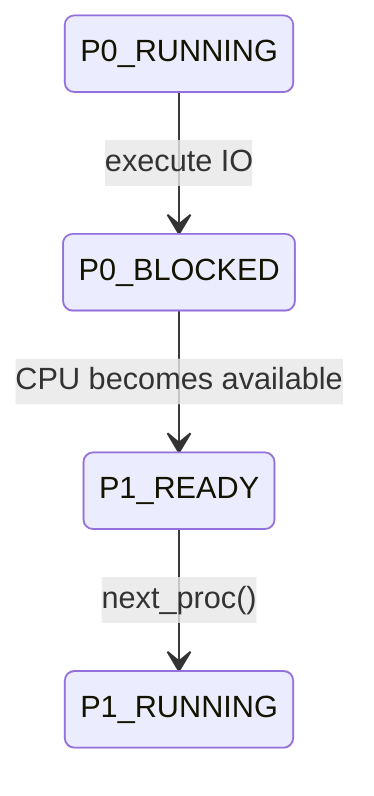
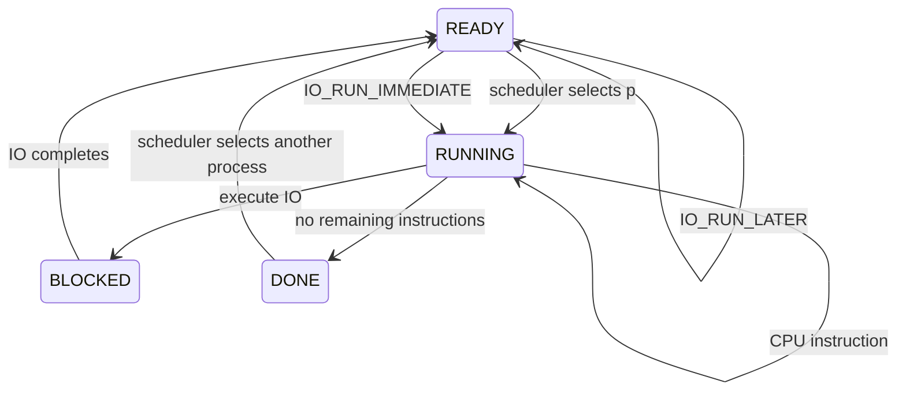
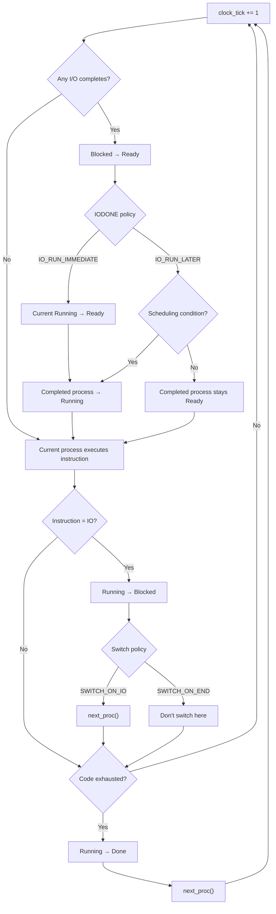

Yes. The switching mechanism is best understood as a **scheduler transition relation layered on top of the process-state ADT**.

The key thing is that this simulator has **two independent policy knobs**:

$$
\boxed{
SwitchPolicy =
OnIO + OnEND
}
$$

and

$$
\boxed{
IODonePolicy =
RunLater + RunImmediate
}
$$

The CLI defaults are `SWITCH_ON_IO` and `IO_RUN_LATER`. 

---

# 1. First: what does "switch" actually mean?

A switch is essentially:

$$
\boxed{
p_{current} \rightarrow p_{next}
}
$$

where the current process stops being `RUNNING` and another `READY` process becomes `RUNNING`.

The actual primitive is:

```python
self.next_proc()
```

and `next_proc()` does:

```python
for pid in range(self.curr_proc + 1, len(self.proc_info)):
    if self.proc_info[pid][PROC_STATE] == STATE_READY:
        self.curr_proc = pid
        self.move_to_running(STATE_READY)
        return
```

If it reaches the end, it wraps around:

```python
for pid in range(0, self.curr_proc + 1):
    if self.proc_info[pid][PROC_STATE] == STATE_READY:
        self.curr_proc = pid
        self.move_to_running(STATE_READY)
        return
```

So the scheduler is basically a **cyclic search through the process set for a READY process**. 

Formally:

$$
next(p,S)
=
\text{first READY process encountered after }p
$$

with wraparound.

---

# 2. The switching algebra

There are actually two kinds of events that can cause switching.

### Event A — current process issues I/O

$$
Running
\xrightarrow{IO}
Blocked
$$

Then, depending on policy:

$$
Blocked + READY
\rightarrow
next\ READY\ process
$$

This is `SWITCH_ON_IO`.

---

### Event B — I/O completes

A blocked process becomes ready:

$$
Blocked
\xrightarrow{IOComplete}
Ready
$$

Then the `-I` policy determines whether that process gets the CPU immediately or waits.

So:

$$
IODonePolicy =
\begin{cases}
Immediate\\
Later
\end{cases}
$$

---

# 3. Trace `SWITCH_ON_IO`

Suppose:

$$
P_0=[CPU,IO,IODONE]
$$

$$
P_1=[CPU,CPU]
$$

Initially:

```text
P0 = RUNNING
P1 = READY
```

At the first CPU tick:

$$
P_0: CPU
$$

No switch.

Next tick:

$$
P_0: IO
$$

The code does:

```python
self.move_to_wait(STATE_RUNNING)
```

so:

$$
P_0:
Running \rightarrow Blocked
$$

Then:

```python
self.io_finish_times[self.curr_proc].append(
    clock_tick + self.io_length + 1
)
```

and, crucially:

```python
if self.process_switch_behavior == SCHED_SWITCH_ON_IO:
    self.next_proc()
```


Therefore:

$$
\boxed{
Running_0
\xrightarrow{IO}
Blocked_0
}
$$

then:

$$
\boxed{
Ready_1
\xrightarrow{scheduler}
Running_1
}
$$

So the full transition is:



This is why `SWITCH_ON_IO` is basically:

> **"If the current process blocks, immediately find somebody else to run."**

---

# 4. What changes with `SWITCH_ON_END`?

Now suppose:

```text
P0 = CPU, CPU, IO
P1 = CPU, CPU, CPU
```

With:

```text
-S SWITCH_ON_END
```

when P0 executes IO:

$$
P_0:
Running\rightarrow Blocked
$$

but this condition is false:

```python
if self.process_switch_behavior == SCHED_SWITCH_ON_IO:
```

So **no `next_proc()` occurs at that point**. 

This is a subtle but important point:

### `SWITCH_ON_END` does not mean "switch whenever a process finishes."

It means the scheduler does **not switch merely because an I/O was issued**.

The process becomes blocked, and switching can subsequently arise through the rest of the scheduling logic.

---

# 5. Now the more interesting part: I/O completion

At every tick the simulator first checks:

```python
if clock_tick in self.io_finish_times[pid]:
```

If true:

```python
self.move_to_ready(STATE_WAIT, pid)
```

Therefore:

$$
\boxed{
Blocked \xrightarrow{I/O\ completion} Ready
}
$$


Then the `-I` policy matters.

---

# 6. `IO_RUN_IMMEDIATE`

With:

```text
-I IO_RUN_IMMEDIATE
```

the code essentially says:

```python
if self.curr_proc != pid:
    if current_process is RUNNING:
        move current process to READY

self.next_proc(pid)
```


So:

$$
P_{io}:
Blocked\rightarrow Ready
$$

then:

$$
P_{current}:
Running\rightarrow Ready
$$

then:

$$
P_{io}:
Ready\rightarrow Running
$$

The I/O-completing process **preempts the current process**.

Formally:

$$
\boxed{
(B_i,C)
\xrightarrow{IOComplete_i}
(R_i,R_C)
\xrightarrow{schedule(i)}
(R_i,R_C)
}
$$

with:

$$
i\rightarrow Running
$$

In simpler notation:

$$
\boxed{
Blocked_i
\rightarrow
Ready_i
\rightarrow
Running_i
}
$$

**immediately**.

---

# 7. `IO_RUN_LATER`

This is more subtle.

The code instead checks:

```python
if self.process_switch_behavior == SCHED_SWITCH_ON_END \
        and self.get_num_runnable() > 1:
    self.next_proc(pid)

if self.get_num_runnable() == 1:
    self.next_proc(pid)
```


So the I/O-completing process becomes:

$$
Blocked\rightarrow Ready
$$

but **doesn't necessarily take the CPU**.

This is the important conceptual difference:

$$
\boxed{
IO\ completion \neq CPU\ acquisition
}
$$

Completion makes the process **READY**.

Scheduling determines whether it becomes **RUNNING**.

---

# 8. Full switching state machine

Now we can put all four combinations together.



But there is an important correction to the last conceptual edge: `DONE` itself isn't made `READY`; rather, `check_if_done()` marks the current process `DONE` and then calls `next_proc()`, which selects an already-`READY` process. 

So the actual transition is:

$$
Running_i
\rightarrow
Done_i
$$

and separately:

$$
Ready_j
\rightarrow
Running_j
$$

---

# 9. The complete scheduler decision tree

You can think of `run()` as repeatedly executing this:



---

# 10. The clean ADT formulation

This is probably the most useful abstraction for your formalization.

Define:

$$
ProcessState =
Ready + Running + Blocked + Done
$$

and:

$$
SwitchPolicy =
OnIO + OnEnd
$$

and:

$$
IODonePolicy =
Immediate + Later
$$

Then define a scheduling function:

$$
\boxed{
Schedule :
SystemState \times Policy
\rightarrow
SystemState
}
$$

The key transition operators are:

### CPU execution

$$
Running
\xrightarrow{CPU}
Running
$$

### I/O issue

$$
Running
\xrightarrow{IO}
Blocked
$$

### I/O completion

$$
Blocked
\xrightarrow{IOComplete}
Ready
$$

### Scheduling

$$
Ready
\xrightarrow{Schedule}
Running
$$

### Process completion

$$
Running
\xrightarrow{EOF}
Done
$$

So the **scheduler isn't itself the process state machine**.

Rather:

$$
\boxed{
\text{Process State Machine}
+
\text{Scheduling Policy}
=
\text{Runtime Transition System}
}
$$

And the two policy dimensions are orthogonal:

$$
\boxed{
Policy =
SwitchPolicy \times IODonePolicy
}
$$

giving four configurations:

| `-S`            | `-I`               | Intuition                                               |
| --------------- | ------------------ | ------------------------------------------------------- |
| `SWITCH_ON_IO`  | `IO_RUN_LATER`     | Switch when process blocks; completed I/O usually waits |
| `SWITCH_ON_IO`  | `IO_RUN_IMMEDIATE` | Switch on I/O; I/O completion immediately gets CPU      |
| `SWITCH_ON_END` | `IO_RUN_LATER`     | Don't switch merely on I/O; completion generally waits  |
| `SWITCH_ON_END` | `IO_RUN_IMMEDIATE` | Don't switch on I/O, but completion can preempt         |

The CLI explicitly defines these two policy axes. 

**One particularly important mental model:** `next_proc()` is the *mechanism*, while `SWITCH_ON_IO` / `SWITCH_ON_END` and `IO_RUN_IMMEDIATE` / `IO_RUN_LATER` are *policy*. The code separates those concepts surprisingly cleanly.
