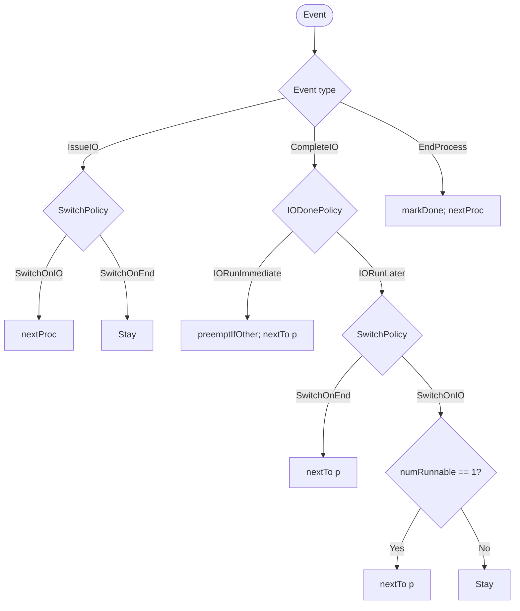
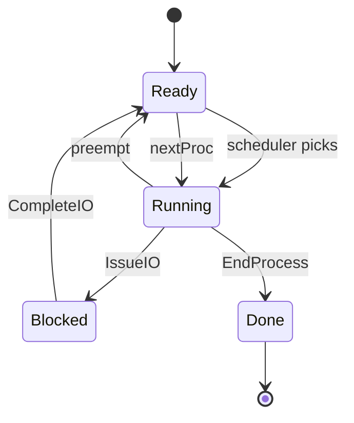

# For Switching computations. 

$$
\begin{aligned}
\delta &: \mathcal{P} \times \mathcal{E} \times \mathcal{S} \to \mathcal{S} \\[2mm]

\mathcal{P} &\cong \mathrm{SwitchPolicy} \times \mathrm{IODonePolicy} \\
\mathrm{SwitchPolicy} &\cong \mathrm{SwitchOnIO} \mid \mathrm{SwitchOnEnd} \\
\mathrm{IODonePolicy} &\cong \mathrm{IORunLater} \mid \mathrm{IORunImmediate} \\[2mm]

\mathcal{E} &\cong \mathrm{IssueIO}(\mathrm{Pid})
              \mid \mathrm{CompleteIO}(\mathrm{Pid},\mathrm{Time})
              \mid \mathrm{EndProcess}(\mathrm{Pid})
              \mid \mathrm{Tick} \\[2mm]

\mathcal{S} &\cong \mathrm{Sched}\{\
                \mathrm{procs} : \mathrm{Map}\ \mathrm{Pid}\ \mathrm{Proc},\
                \mathrm{curr} : \mathrm{Pid},\
                \mathrm{ioFinish} : \mathrm{Map}\ \mathrm{Pid}\ [\mathrm{Time}],\
                \mathrm{time} : \mathrm{Time},\
                \mathrm{policy} : \mathcal{P}\
              \} \\[4mm]

\delta(\mathrm{Policy}\;\mathrm{SwitchOnIO}\;\_,\ \mathrm{IssueIO}(p),\ s)
  &= \mathrm{nextProc}(s) \\
\delta(\mathrm{Policy}\;\mathrm{SwitchOnEnd}\;\_,\ \mathrm{IssueIO}(p),\ s)
  &= s \\[2mm]

\delta(\mathrm{Policy}\;\_\;\mathrm{IORunImmediate},\ \mathrm{CompleteIO}(p,t),\ s)
  &= \mathrm{nextTo}\bigl(p,\ \mathrm{preemptIfOther}(p,\ \mathrm{wake}(p,s))\bigr) \\
\delta(\mathrm{Policy}\;\mathrm{SwitchOnEnd}\;\mathrm{IORunLater},\ \mathrm{CompleteIO}(p,t),\ s)
  &= \mathrm{nextTo}\bigl(p,\ \mathrm{wake}(p,s)\bigr) \\
\delta(\mathrm{Policy}\;\mathrm{SwitchOnIO}\;\mathrm{IORunLater},\ \mathrm{CompleteIO}(p,t),\ s)
  &= \begin{cases}
      \mathrm{nextTo}\bigl(p,\ \mathrm{wake}(p,s)\bigr), & \text{if } \mathrm{runnable}(s)=1,\\
      s, & \text{otherwise}
    \end{cases} \\[2mm]

\delta(\_,\ \mathrm{EndProcess}(p),\ s)
  &= \mathrm{nextProc}\bigl(\mathrm{markDone}(p,s)\bigr)
\end{aligned}
$$


## Scheduler Policy x Event x State Algebra:

The scheduler policy is a **product of two independent choices**:

- **Switch policy** — when do we switch away from the current process?
- **IO-done policy** — what happens when an I/O finishes?

So the ADT is:

```text
Policy = SwitchPolicy × IODonePolicy

SwitchPolicy = SwitchOnIO | SwitchOnEnd
IODonePolicy = IORunLater | IORunImmediate
```

### Switch policy

- **`SwitchOnIO`**  
  When the running process issues an I/O, it moves to `BLOCKED`, and the scheduler immediately picks the next `READY` process.  
  This is the normal “don’t waste CPU on a blocked process” policy.

- **`SwitchOnEnd`**  
  When the running process issues an I/O, it still moves to `BLOCKED`, but the scheduler does **not** switch to another process.  
  The CPU can sit idle until the I/O finishes or the process ends.

### IO-done policy

- **`IORunLater`**  
  When an I/O completes, the process becomes `READY`. It does **not** preempt the current process unless there is no other runnable process.  
  Exception: if the switch policy is `SwitchOnEnd`, the I/O process is resumed immediately because no other process was allowed to run while it was blocked.

- **`IORunImmediate`**  
  When an I/O completes, the process becomes `READY` and immediately preempts the current running process if it is different.  
  The scheduler switches to the woken process right away.

### End of process

When a process finishes all its instructions, it becomes `DONE`, and the scheduler picks the next `READY` process.

---

## Mermaid: policy decision flow



---

## Mermaid: process state transitions



---

## Policy combinations at a glance

| Switch policy | IO-done policy | What happens |
|---|---|---|
| `SwitchOnIO` | `IORunLater` | Switch away on I/O issue. When I/O completes, the woken process waits its turn, unless it is the only runnable process. |
| `SwitchOnIO` | `IORunImmediate` | Switch away on I/O issue. When I/O completes, preempt the current process and run the woken process immediately. |
| `SwitchOnEnd` | `IORunLater` | Do not switch on I/O issue. CPU may idle. When I/O completes, resume the woken process. |
| `SwitchOnEnd` | `IORunImmediate` | Same as above, but explicitly preempts any different running process before running the woken process. |

The algebra is therefore just:

```text
δ : Policy × Event × Sched → Sched
```

where `Policy` is the pair `(SwitchPolicy, IODonePolicy)`, and the transition rules are exactly the branches shown in the mermaid flowchart.