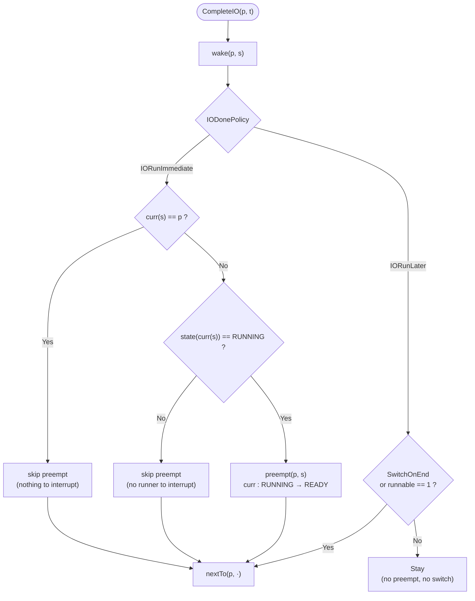

## Refining your idea

You're close, but two adjustments make it cleaner:

1. **Preemption is a partial function, not a triple.**  
   A triple `(input, state, new_state)` is an element of a relation. Preemption itself is better modeled as a function on scheduler states, defined only on a subset of them.

2. **"Priority" isn't a separate attribute on the process.**  
   Priority is *conferred by the policy*. Under `IORunImmediate`, the I/O‑completing process *always* has priority. Under `IORunLater`, it does *not* — it just becomes `READY` and waits its turn.

So preemption is not "if priority then interrupt"; it's "the `IORunImmediate` policy *is* the rule that says interrupt".

---

## Preemption as a partial function

$$
\operatorname{preempt} : (\mathrm{Pid} \times \mathcal{S}) \rightharpoonup \mathcal{S}
$$

**Defined only when:**

$$
p \ne \operatorname{curr}(s) \quad \wedge \quad \operatorname{state}\bigl(\operatorname{curr}(s),\, s\bigr) = \mathrm{RUNNING}
$$

**Effect when defined:**

$$
\operatorname{preempt}(p, s) = s'
\quad\text{where}\quad
\begin{cases}
\operatorname{curr}(s') = \operatorname{curr}(s) \\[1mm]
\operatorname{state}\bigl(\operatorname{curr}(s),\, s'\bigr) = \mathrm{READY} \\[1mm]
\text{all other fields unchanged}
\end{cases}
$$

It is **undefined** when:

- `p = curr(s)` — the woken process *is* the running one, nothing to preempt.
- `state(curr(s)) ≠ RUNNING` — there is no running process to interrupt.

---

## Why a partial function and not a triple

Your intuition "`(Process, Event)`, `S`, `S'`" is a **relation** view:

$$
R_{\text{preempt}} \subseteq \bigl(\mathrm{Pid} \times \mathcal{E}\bigr) \times \mathcal{S} \times \mathcal{S}
$$

That's fine, but it collapses two distinct steps:

| Step | Function | Type |
|---|---|---|
| 1. Wake the I/O process | `wake(p, ·)` | `S → S` (total) |
| 2. Preempt the runner | `preempt(p, ·)` | `S ⇀ S` (partial) |
| 3. Install the woken process | `nextTo(p, ·)` | `S → S` (total) |

Preemption is step 2 alone. The triple you described is really the *composition* of all three — i.e., the whole `CompleteIO` handler, not preemption by itself.

---

## Composition: the `CompleteIO` handler

**`IORunImmediate`:**

$$
\delta(\_, \mathrm{IORunImmediate}, \mathrm{CompleteIO}(p,t), s)
= \operatorname{nextTo}\bigl(p,\ \operatorname{preempt}_{\text{maybe}}(p,\ \operatorname{wake}(p, s))\bigr)
$$

where `preempt_maybe` is the totalization of the partial function:

$$
\operatorname{preempt}_{\text{maybe}}(p, s) =
\begin{cases}
\operatorname{preempt}(p, s), & \text{if } \operatorname{preempt}(p,s) \text{ is defined} \\[1mm]
s, & \text{otherwise}
\end{cases}
$$

**`IORunLater`:**

No preemption step at all — just wake, and then schedule only if the switch policy allows it:

$$
\delta(\_, \mathrm{IORunLater}, \mathrm{CompleteIO}(p,t), s)
= \operatorname{nextTo}\bigl(p,\ \operatorname{wake}(p, s)\bigr)
\quad\text{(only under SwitchOnEnd or when runnable = 1)}
$$

So preemption is *unique to* `IORunImmediate`. `IORunLater` never preempts.

---

## Mermaid: preemption as a guarded partial map

The two dashed branches `D → E` and `F → G` are exactly the **undefined region** of `preempt`. That's why it's partial: outside its domain, the handler simply skips it and falls through to `nextTo`.

---

## One‑line summary

$$
\boxed{\;
\operatorname{preempt} : (\mathrm{Pid} \times \mathcal{S}) \rightharpoonup \mathcal{S}
\;\text{ is defined iff } \operatorname{curr}(s) \ne p \wedge \operatorname{state}(\operatorname{curr}(s)) = \mathrm{RUNNING}
\;}
$$

Preemption is not "the process has priority"; it is the *policy‑specific step* that turns the current runner from `RUNNING` back to `READY` so that a woken I/O process can be installed by `nextTo`. Under `IORunLater` that step is never taken.