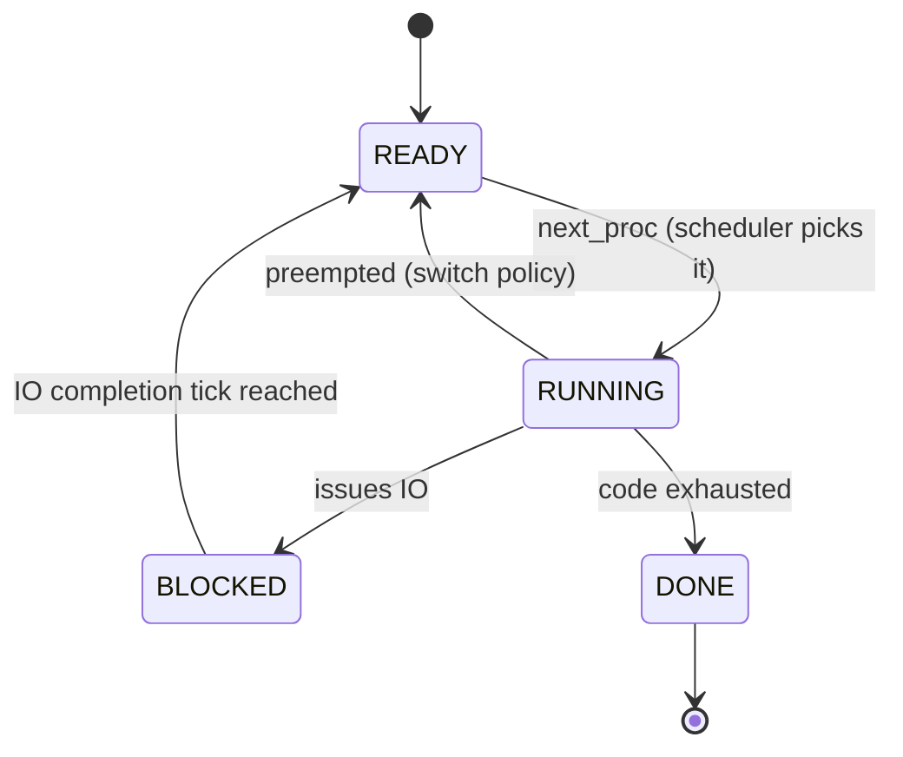

## Funnel: what "refactor" actually has to fix, in dependency order

Your terminal goal is a **pure, testable state-transition scheduler** (immutable `SchedulerState` + explicit `SchedulerConfig`, functions as morphisms rather than methods with side effects). The bugs in the current draft aren't independent — they form a causal chain, so I'll order the critique by *what has to be true before the next layer's correctness even matters*.

### Level 0 — Show-stoppers (arity/attribute errors: the program cannot execute)
These are not design smells, they're **call-site/callee signature divergence**:
- `new_scheduler_state()` is called in `main()` with zero args but declared with 3 positional params, and its body then constructs `SchedulerState(... process_switch_behavior=..., io_done_behavior=...)` — kwargs that **don't exist on the dataclass**. This is a category error: policy parameters are being injected into the state's constructor.
- `handle_scheduler_step` is defined `(scheduler_state, scheduler_config)` but called as `handle_scheduler_step(scheduler_state, scheduler_metrics, scheduler_config)` in `run()`.
- `run()` is declared `-> Tuple[int,int,int]` but has no `return` in the inductive branch → `main()`'s tuple-unpack fails.
- `handle_execute_instructions` checks `ProcessState.Running` (doesn't exist; the enum member is `RUNNING`).
- `load()` mutates `SchedulerState.proc_info[pid]` — the **class object**, not the `scheduler_state` instance parameter.
- `set_curr_proc_info` uses `get_current_proc_info(scheduler_state)` (a `ProcessInfo` object) as a **dict key**, when it should be `scheduler_state.curr_proc` (the `int` pid).

None of this is fixable by "polishing" — it means the module was never run after the OOP→functional transliteration. Fix these first or nothing downstream is even observable.

### Level 1 — Referential-transparency discipline is applied inconsistently
This is the real architectural finding, and it's the same bug pattern repeated ~5 times: you correctly modeled `transition_to_running` etc. as **pure functions returning a new immutable value** (`replace(p, state=...)` — good, this is the right primitive), but at every call site the *result is either discarded or misassigned to the wrong variable*:

```python
scheduler_state = transition_to_ready(get_proc_info_by_pid(pid, scheduler_state), ProcessState.RUNNING)
```
This rebinds `scheduler_state` (a `SchedulerState`) to a `ProcessInfo` — the write-back step (`set_proc_info_by_pid`) is missing. Same shape of bug in `handle_process_switching`, `handle_process_step`, and `resolve_done` (which computes `transition_to_done(...)` and throws the result away entirely, then proceeds as if the mutation happened — a holdover from doc2's mutate-`self` mental model).

**Labeled precisely:** you have a *get→transform→forget-to-put* pattern, i.e. the "lens" (get/set pair) exists (`get_proc_info_by_pid` / `set_proc_info_by_pid`) but is never composed atomically. This is exactly the class of bug functional cores are supposed to make *structurally impossible* — right now it's just as easy to introduce as it was in the mutable version, which means the refactor hasn't yet earned its complexity cost.

### Level 2 — Representation dishonesty (types assert invariants the runtime violates)
`ProcessInfo.code: Tuple[str, ...]` is commented "immutable" — but `new_process` initializes it to `[]` and `load_program`/`handle_execute_instructions` call `.append()` / `.pop(0)` on it. A tuple has neither method; this only "works" because the actual object is a `list`, meaning the type annotation is **false**, and any static checker (mypy/pyright) you might run gets nothing but noise from this module. Same issue in `new_process`: `scheduler_state.proc_info[proc_id] = {}` followed by `.pc = 0` attribute-assignment on a *dict*, when the field is typed `Dict[int, ProcessInfo]`.

Pick one and be honest about it:
- **True immutability**: `code: Tuple[Instruction, ...]`, advance via an index (`pc`) into it, never mutate — `pop(0)` becomes `code[pc]`.
- **True mutability**: drop the `Tuple` annotation and the "immutable" comment, accept it's a mutable list-of-instructions inside an otherwise-immutable-by-convention record.

Right now you have neither — the type signature is decorative, not a contract.

### Level 3 — Config/State conflation (the one place your instinct was *right* but incomplete)
Splitting `SchedulerConfig` (policy: `IORunPolicy`, `SchedulerSwitchPolicy`, `io_length`) from `SchedulerState` (mechanism: `proc_info`, `clock_tick`, ...) is the correct move — it's a clean separation of the invariant parameters of the transition function from its varying argument. `new_scheduler_state` just needs to *stop* trying to fold config fields into the state dataclass. This is worth preserving, not undoing.

### Level 4 — Missing domain semantics (not a bug, a dropped feature)
Nowhere in doc1 does anything append to `io_finish_times[pid]`. In doc2, issuing `DO_IO` schedules a future completion tick (`clock_tick + io_length + 1`); doc1's `handle_execute_instructions` pops the `IO` instruction but never schedules its completion, so IO never resolves — processes would hang in `BLOCKED` forever even once the arity bugs are fixed. This has to be re-derived from doc2 before any correctness discussion is meaningful.

---

## Where this maps onto Lampson's hints

| Lampson hint | Status here |
|---|---|
| *Get the interfaces right; keep them simple* | Violated — types (`Tuple`, dict-vs-dataclass) lie about the data's actual shape, so the "interface" is not trustworthy. |
| *Separate mechanism from policy* | Correctly attempted (`SchedulerConfig` vs `SchedulerState`) but not fully wired through. |
| *Make actions atomic* | Violated — the get/transform/write-back triple is never atomic; intermediate states leak (updates silently dropped in `resolve_done`, `handle_process_switching`). |
| *Handle normal and worst case separately, but keep the normal case fast/clean* | Partially honored by `assert`-guarded transitions — see formalization below, this is actually a good pattern, keep it. |
| *Keep it simple — remove what you don't need* | Violated — dead imports (`from pickle import PERSID`), large commented-out constant blocks from the pre-refactor version. |

---

## Formalizing the *target* model (set theory + category theory, expanded)

Your own comment "free monoid of program" is exactly the right instinct — it's worth making explicit and then holding the implementation accountable to it.

**State space as a set.** Let $P$ be the finite set of process ids, $I=\{\mathrm{COMPUTE},\mathrm{IO},\mathrm{IO\_DONE}\}$ the instruction alphabet, and $Q=\{\mathrm{READY},\mathrm{RUNNING},\mathrm{BLOCKED},\mathrm{DONE}\}$ the per-process state set. A single process's *code* is a word over $I$ — an element of the **free monoid** $I^{*}$: sequences under concatenation, with the empty sequence $\varepsilon$ as identity. "Free" just means: no relations imposed beyond associativity of concatenation — this is why `load_program` should behave as a **monoid homomorphism**:

$$\text{parse}(a \mathbin{+\!\!+} b) \;=\; \text{parse}(a)\mathbin{+\!\!+}\text{parse}(b)$$

i.e. parsing the concatenation of two comma-strings equals concatenating the parses. That's a concrete, checkable property (good target for a Hypothesis test), and it tells you immediately that `load_program`'s per-process mutation style is the wrong shape for this law — a pure `parse: str -> I*` function is.

**Per-process data** lives in the product set $\mathbb{N}\times I^{*}\times Q$ (pc, remaining code, state). The whole scheduler's state space is:

$$S \;=\; (P \rightharpoonup (\mathbb{N}\times I^{*}\times Q)) \;\times\; P \;\times\; (P \rightharpoonup \mathcal{P}(\mathbb{N})) \;\times\; \mathbb{N}$$

(a partial function from pid to per-process data, the current pid, a partial function from pid to its set of pending IO-completion ticks, and the clock). Note $C$ (`SchedulerConfig`) is **not a coordinate of $S$** — it's the fixed parameter of the transition map, which is precisely the formal version of "Level 3" above: putting `process_switch_behavior` inside `SchedulerState` is a type error at the level of *which set an element lives in*, not just a Python bug.

**Transitions as guarded partial functions.** `transition_to_running(p, expected)` is best understood as a **partial function** $Q \rightharpoonup Q$, restricted to the subset of its domain where `p.state == expected`. The `assert` isn't defensive-programming boilerplate — it's literally *implementing the domain restriction of a partial function*, which is the correct categorical move (rather than making it total and silently doing nothing on a mismatch, which would hide bugs). Keep this pattern; it's the one piece of the current design that's already right.

**The scheduler as an iterated morphism.** One tick is $\delta: S \to S$ (config-parameterized). The whole run is $S_n = \delta^{n}(S_0)$ — a fold, not a while-loop with mutation. This gives you a free correctness law:

$$\delta^{m+n} = \delta^{m}\circ\delta^{n}$$

which is just monoid-action associativity, but it's exactly the property your current code *can't* have, because intermediate `δ` applications drop writes (Level 1). Once every transition is a genuine total function $S \to S$ (not "sometimes returns a `ProcessInfo`, sometimes forgets to write back"), `run` becomes literally `functools.reduce(step, range(n), s0)` and you get replay/checkpointing almost for free — which is the payoff Lampson-style fault-tolerance hints (log updates, make retries idempotent) are gesturing at: purity buys you that property structurally, you don't have to hand-engineer it.



---

## Prioritized refactor sequence

1. **Fix Level 0** (arity/attribute errors) just to get it running — cheap, mechanical.
2. **Re-port IO-completion scheduling** from doc2 (`io_finish_times[pid].append(...)` on `DO_IO`) — without this, "correct" is undefined.
3. **Kill the get/transform/forget pattern structurally**, not case-by-case: write one combinator, e.g. `update_proc(pid, f, state) = set_proc_info_by_pid(pid, f(get_proc_info_by_pid(pid, state)), state)`, and force every transition through it. This makes the Level-1 bug class unrepresentable rather than just patched.
4. **Make the immutability claim true**: either real `Tuple` + `pc`-indexing, or drop the annotation. Don't leave it lying.
5. **Finish the Config/State separation**: `new_scheduler_state` should take zero policy args; `SchedulerConfig` is threaded separately everywhere.
6. **Delete dead code**: unused `PERSID` import, commented pre-refactor constant blocks.
7. **Add the monoid-law tests** (`parse` homomorphism, `δ` fold-associativity) *before* further refactoring — they'll catch regressions the type checker can't, since Python's structural typing won't stop you from re-introducing #1–#3.