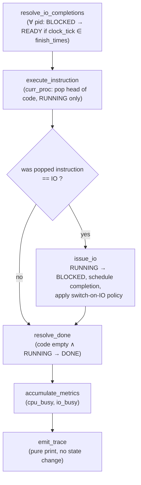

## Funnel: what has to exist before "the rest of the loop" is even well-typed

The missing pieces aren't a random grab-bag — they're determined by **doc2's per-tick causal order**, which your `handle_scheduler_step` only implements half of. One tick in doc2 is a fixed sequence of five sub-transitions on the *current* process, run in this order for a reason (each depends on the previous one's output):



You've written **A** (`handle_process_step`, buggy but present), **B** (`handle_execute_instructions`, correct shape), and a stub of **G** (`emit_scheduler_metrics_and_tick`, never called). **You have not written C/D** — the IO-issuance branch — and **F** is entirely absent (nothing increments `io_busy`; `get_ios_in_flight` is a reader with no writer consuming it). That gap is the actual reason "the rest of the loop" feels unwritten: it's not that `run()` is short, it's that one whole branch of the per-tick decision tree (what happens *when the popped instruction is IO*) doesn't exist yet, and metrics accumulation was never re-derived from doc2 either.

## Set-theoretic frame for what to add

Extend the per-tick map to carry metrics alongside state, i.e. work in the product $S \times M$ where $M = \mathbb{N}\times\mathbb{N}$ (cpu_busy, io_busy). Each sub-transition above is a function $S\times M \to S\times M$ (identity on the factor it doesn't touch), and one tick is their composition:

$$\delta \;=\; \text{emit}\circ\text{accumulate}\circ\text{resolve\_done}\circ\text{issue\_io}\circ\text{execute}\circ\text{resolve\_io}$$

`issue_io` and `resolve_done` are **guarded by the same partiality discipline** as your existing `transition_to_*` functions — they're the identity on $S\times M$ when their precondition (instruction was IO / code is empty) fails, rather than being called-or-not from ad hoc `if` statements scattered across callers. That's the design property to aim for: `handle_scheduler_step` becomes one linear pipe, not a per-pid loop with conditionals re-derived at each call site.

## The missing functions

**1. IO issuance (the actual gap — C/D above):**

```python
def handle_io_issue(
    scheduler_state: SchedulerState,
    scheduler_config: SchedulerConfig,
    instruction_executed: Instruction,
) -> SchedulerState:
    # guarded identity: only acts when the instruction just popped was IO
    if instruction_executed != Instruction.IO:
        return scheduler_state

    pid = scheduler_state.curr_proc
    proc_info = get_proc_info_by_pid(pid, scheduler_state)
    new_proc_info = transition_to_wait(proc_info, ProcessState.RUNNING)
    scheduler_state = set_proc_info_by_pid(pid, new_proc_info, scheduler_state)

    finish_tick = scheduler_state.clock_tick + scheduler_config.io_length + 1
    scheduler_state.io_finish_times[pid] = scheduler_state.io_finish_times[pid] + [
        finish_tick
    ]

    if scheduler_config.process_switch_policy == SchedulerSwitchPolicy.ON_IO:
        scheduler_state = next_proc(scheduler_state)

    return scheduler_state
```

**2. Metrics accumulation (F — currently absent entirely):**

```python
def accumulate_metrics(
    scheduler_state: SchedulerState,
    scheduler_metrics: SchedulerMetrics,
    instruction_executed: Instruction,
) -> SchedulerMetrics:
    cpu_delta = 1 if instruction_executed != "" else 0
    io_delta = (
        1 if get_ios_in_flight(scheduler_state, scheduler_state.clock_tick) > 0 else 0
    )
    return replace(
        scheduler_metrics,
        cpu_busy=scheduler_metrics.cpu_busy + cpu_delta,
        io_busy=scheduler_metrics.io_busy + io_delta,
    )
```
(`SchedulerMetrics` should be `frozen=True` like `SchedulerConfig` if you want `replace` here instead of in-place `+=` — currently it's mutable, which is inconsistent with the rest of your immutable-record convention.)

**3. Header emission (missing — doc2 prints a header row once before the loop; doc1 has no equivalent):**

```python
def emit_header(scheduler_state: SchedulerState) -> None:
    print("%s" % "Time", end="")
    for pid in range(get_num_processes(scheduler_state)):
        print("%14s" % ("PID:%2d" % pid), end="")
    print("%14s%14s" % ("CPU", "IOs"))
```

**4. `handle_scheduler_step`, corrected to actually be the composed pipe** (currently it only calls `handle_process_step` per pid and never calls execute/issue/accumulate/emit at all):

```python
def handle_scheduler_step(
    scheduler_state: SchedulerState,
    scheduler_metrics: SchedulerMetrics,
    scheduler_config: SchedulerConfig,
) -> Tuple[SchedulerState, SchedulerMetrics]:
    scheduler_state = replace(
        scheduler_state, clock_tick=scheduler_state.clock_tick + 1, io_done=False
    )

    for pid in range(get_num_processes(scheduler_state)):
        scheduler_state = handle_process_step(scheduler_state, pid, scheduler_config)

    scheduler_state, scheduler_metrics, instr = handle_execute_instructions(
        scheduler_state, scheduler_metrics
    )
    scheduler_state = handle_io_issue(scheduler_state, scheduler_config, instr)
    scheduler_state = resolve_done(scheduler_state)
    scheduler_metrics = accumulate_metrics(scheduler_state, scheduler_metrics, instr)
    emit_scheduler_metrics_and_tick(scheduler_state, instr)

    return scheduler_state, scheduler_metrics
```

This also forces two prior fixes into place as *prerequisites*, not afterthoughts: `handle_process_step` must return `scheduler_state` (currently it doesn't — falls off the end returning `None`), and `resolve_done`/`transition_to_done` must write back through `set_proc_info_by_pid` (currently discarded, per the Level-1 bug from before). You can't add the IO-issue branch correctly on top of a pipe that's still silently dropping state.

**5. `run()`, folding rather than looping-with-forgotten-returns:**

```python
def run(
    scheduler_state: SchedulerState, scheduler_config: SchedulerConfig
) -> Tuple[int, int, int]:
    if get_num_processes(scheduler_state) == 0:
        return (0, 0, 0)

    scheduler_state = next_proc(
        scheduler_state, pid=0
    )  # doc2's initial move_to_running(READY)
    emit_header(scheduler_state)
    scheduler_metrics = new_scheduler_statistics()

    while get_num_active(scheduler_state) > 0:
        scheduler_state, scheduler_metrics = handle_scheduler_step(
            scheduler_state, scheduler_metrics, scheduler_config
        )

    return (
        scheduler_metrics.cpu_busy,
        scheduler_metrics.io_busy,
        scheduler_state.clock_tick,
    )
```

## What this doesn't fix yet

`next_proc`'s wrap-around branch still references bare `proc_info[pid]` instead of `get_proc_info_by_pid(pid, scheduler_state)` — that's a leftover Level-0 bug, not new. And `handle_process_step`'s call `transition_to_ready(get_proc_info_by_pid(scheduler_state, pid), ...)` has its arguments to `get_proc_info_by_pid` reversed (signature is `(pid, scheduler_state)`). Both need the earlier fix pass before this pipeline runs correctly — the IO-issuance code above is the *missing branch*, but it's being grafted onto a trunk that still has two standing fractures from the previous review.