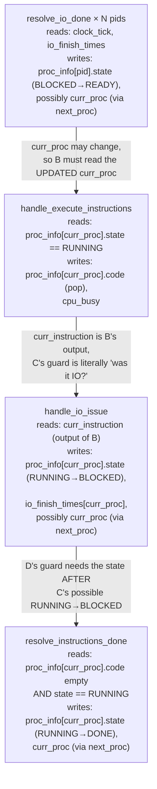

## Funnel: trace the crash to its root, then fix

**Causal chain:** `next_proc` is called with **no explicit `pid`** (the "find next READY process" branch) from two call sites: `handle_io_done_process_switching` and — critically — `resolve_instructions_done`, unconditionally, right after transitioning the current process to `DONE`. Both loops inside `next_proc` only `return` **when they find a `READY` candidate**. When the process that just finished was the *last* runnable one, neither loop finds anything, the function falls off the end, and Python's implicit `return None` fires. `resolve_instructions_done` then does `scheduler_state = next_proc(scheduler_state)` — binding `scheduler_state` to `None` — and returns it as-is. The next call in the pipe (`get_ios_in_flight`, or the next tick's `resolve_instructions_done`) dereferences `None.proc_info` and crashes.

**Root cause, stated precisely:** `next_proc` is a **partial function** $S \rightharpoonup S$ (undefined when no `READY` process exists), but every caller treats it as **total**. The fix is to make it total by adding the missing base case — "no next process to switch to" is not an error, it's the legitimate signal that the system is terminating, so the correct morphism there is the **identity on $S$**, not $\bot$.

```python
# fix: next_proc must be total — identity when no READY process exists
def next_proc(scheduler_state: SchedulerState, pid: int = -1) -> SchedulerState:
    if pid != -1:
        scheduler_state.curr_proc = pid
        proc_info = get_current_proc_info(scheduler_state)
        new_proc_info = transition_to_running(proc_info, ProcessState.READY)
        return set_proc_info_by_pid(pid, new_proc_info, scheduler_state)

    for pid in range(scheduler_state.curr_proc + 1, get_num_processes(scheduler_state)):
        if get_proc_info_by_pid(pid, scheduler_state).state == ProcessState.READY:
            scheduler_state.curr_proc = pid
            proc_info = get_current_proc_info(scheduler_state)
            new_proc_info = transition_to_running(proc_info, ProcessState.READY)
            return set_proc_info_by_pid(pid, new_proc_info, scheduler_state)

    for pid in range(0, scheduler_state.curr_proc + 1):
        if get_proc_info_by_pid(pid, scheduler_state).state == ProcessState.READY:
            scheduler_state.curr_proc = pid
            proc_info = get_current_proc_info(scheduler_state)
            new_proc_info = transition_to_running(proc_info, ProcessState.READY)
            return set_proc_info_by_pid(pid, new_proc_info, scheduler_state)

    return scheduler_state  # no READY process exists — identity, not None
```

---

## DAG of the four per-tick sub-steps

The order in `handle_scheduler_step` is not incidental — each step's **guard condition reads a field that the previous step writes**, so this is a genuine dependency chain, not an arbitrary sequencing choice.



## Do they commute? — formal answer, per pair

Model each step as an element of $\mathrm{End}(S)$ (an endomorphism of the state set), and ask when two such elements commute, i.e. $f\circ g = g\circ f$. Two partial/guarded functions commute **only if their guards read disjoint fields and their writes don't shadow each other's preconditions** — that's the set-theoretic content of "commute" here, no category-theoretic machinery needed beyond composition.

| Pair | Commute? | Why |
|---|---|---|
| $A$ (resolve_io_done, all pids) vs. $B$ (execute) | **No** | $A$ can reassign `curr_proc` (via `handle_io_done_process_switching → next_proc`). $B$'s guard reads `proc_info[curr_proc]` — the *current* curr_proc, post-$A$. Running $B$ first would execute the *wrong* process's instruction. |
| $B$ (execute) vs. $C$ (io_issue) | **No** — genuinely sequential, not just ordered by convention | $C$'s guard is `curr_instruction == Instruction.IO`, and `curr_instruction` **is** $B$'s output. There is no "swap the order" here: $C$ is literally a continuation of $B$, not an independent morphism on $S$ that happens to be scheduled after it. |
| $C$ (io_issue) vs. $D$ (resolve_done) | **No, but for a subtler reason — mutual exclusion, not just ordering** | $D$'s guard requires `state == RUNNING`; $C$, when it fires, transitions `RUNNING → BLOCKED`. So if $C$ fires, $D$'s guard is *false* immediately after — the two guards are **disjoint on the RUNNING dimension by construction**. Running $D$ *before* $C$ would let $D$ incorrectly treat an about-to-block process as finished if its code happens to be empty at that exact tick (e.g. an `IO` instruction that was also the last one). This is the one pair where getting the order wrong produces a *silent* logic bug rather than a crash — worth a regression test specifically for "process's last instruction is IO." |
| $A$ across different pids (the inner loop) | **Yes, commute** | Each iteration of $A$ only ever writes `proc_info[pid]` for its *own* `pid` (plus possibly `curr_proc`, but only if that `pid` triggers a switch) — writes to distinct dictionary keys don't interfere, so $A(\text{pid}=i)$ and $A(\text{pid}=j)$ for $i\neq j$ commute **unless both independently trigger `next_proc`**, in which case the *second* call's switch silently overrides the first's — a benign but real non-commutativity if two IOs complete on the same tick under `IMMEDIATE` policy. Flag this as a design question (which of two simultaneously-ready processes should win?) rather than a bug — currently "last pid in iteration order wins," which is an implicit, undocumented policy. |

**Summary of the causal structure:** this is not four independent transitions that got serialized by convention — it's **one composite morphism** $D\circ C\circ B\circ A_N\circ\cdots\circ A_1$ where each factor's *domain of definition* (its guard) is carved out by the *previous* factor's *codomain* (its write). That's exactly why reordering any adjacent pair either crashes (reads a stale `curr_proc`) or silently misclassifies a process's state (the $C$/$D$ mutual-exclusion case) — the pipeline has zero slack for reassociation, which is worth stating as an invariant comment above `handle_scheduler_step` rather than leaving it implicit in call order.